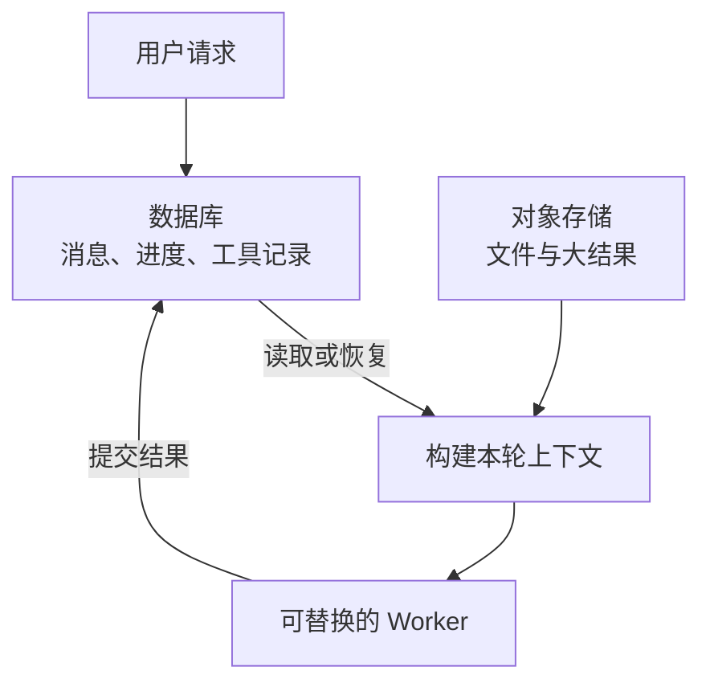

服务发布一次，Agent 就忘了刚才聊到哪里，这个问题往往从一个很方便的写法开始。按用户 ID 在内存里放一个 `messages` 列表，再把 Agent 对象挂到会话上。进程一直活着时，功能看起来没问题。

一旦重启，列表和对象都会消失。即使没有重启，部署两个实例以后，同一个用户的下一次请求落到另一个实例，也可能突然失忆。负载均衡的会话保持可以暂时掩盖这个问题，无法替代持久化。

云端服务需要能从进程外找回已经确认的消息、执行进度和工具结果，再组装下一次模型请求。丢掉旧进程以后，业务上仍然知道用户说过什么、工作做到哪里、哪些动作已经发生，这才算恢复。

这件事和长期记忆、RAG 有交集，但存储要求不同。用户的偏好以后可以检索回来，刚刚执行过的工具却不能靠相似度搜索猜它是否成功。

## 从事实和派生结果分开看

Martin Kleppmann 在讨论日志与数据系统时，分析过双写带来的部分失败和顺序不一致，也说明了如何用持久化的有序记录重建派生数据。这里借用的是这种区分事实与派生结果的方法。[Kleppmann 关于日志与双写的原文](https://martin.kleppmann.com/2015/05/27/logs-for-data-infrastructure.html)

把这个视角应用到 Agent，可以得到一个有用的设计判断。消息和已经取得的工具结果属于恢复依据；内存里的 Agent 对象，以及为本次推理挑选出来的上下文，可以从这些依据重新构建。

这个判断是本文对 Agent 场景的应用，原文讨论的是数据系统。它也不要求项目立刻引入 Kafka，或把全部业务改成 Event Sourcing。小型服务完全可以先用 PostgreSQL 的业务表、事务和检查点。先明确每类数据以哪里为准，比增加组件更紧要。

## “上下文丢了”可能丢的是不同东西

把所有问题都归为聊天记录没有保存，会漏掉执行中的状态。

| 状态 | 需要保存什么 | 丢失后的后果 |
| --- | --- | --- |
| 会话消息 | 用户输入、完整模型输出、消息顺序、工具调用与返回的关联 ID | 记不住前文，或者构造出不完整的工具对话 |
| 执行进度 | 当前阶段、已完成节点、待办节点、等待的审批或外部任务 | 知道聊过什么，却不知道下一步该做什么 |
| 工具操作 | 参数、操作 ID、幂等键、执行状态、结果或结果引用 | 重复执行，或者把未知结果误当成失败 |
| 工作产物 | 文件、检索原文、图片、报告，以及稳定地址和校验信息 | 历史消息还在，引用的文件已经不存在 |
| 用户与项目资料 | 经确认的偏好、项目配置、长期记忆及其版本 | 能恢复本轮，但后续回答缺少个性化依据 |
| 临时运行资源 | 连接池、协程、锁、SDK 客户端、进程内缓存 | 需要重新创建，通常不应序列化保存 |

模型推理侧的 KV Cache 又是另一回事。它缓存推理中已经计算过的中间结果，与应用的消息数据库分属不同层。[Hugging Face 的 KV Cache 说明](https://huggingface.co/docs/transformers/cache_explanation)

把聊天记录落库，不会保存某次尚未结束的远程推理，也不能保证重新请求时逐字生成相同答案。具体供应商如果提供会话保存或请求恢复能力，还要单独核对保留期限与 API 语义。

我的取舍是，应用必须掌握业务恢复所需的数据。供应商会话 ID、Prompt Cache 和实例内存都可以帮助提速，不把它们当作唯一的业务记录。

## 一个进程可以丢掉，哪些东西不能跟着丢

适合多数中小型云端 Agent 的起点，是无状态的 API 实例和可替换的 Worker，共享一个持久化数据库。大文件放对象存储，Redis 按需要承担缓存、限流等工作。

“无状态”在这里指实例没有独占且无法恢复的业务状态。运行期间仍然有内存对象，连接池也需要保留，只是其他实例能够从持久化数据重建继续执行所需的信息。



数据库和对象存储的生命周期要独立于应用实例。如果把 SQLite 文件写在容器可写层，代码里的 `save()` 即使成功，Pod 被替换后文件也可能不在。Kubernetes 的 `emptyDir` 在同一 Pod 的容器重启之间可以保留，但 Pod 被移除后会被删除，不能把这两种重启混为一谈。[Kubernetes 的卷生命周期](https://kubernetes.io/docs/concepts/storage/volumes/#emptydir)

单机应用使用 SQLite 加持久卷也能跨进程恢复。需要多实例接入、数据库高可用和备份时，我会优先评估托管 PostgreSQL，避免把共享本地文件、并发写入和故障切换一起带进业务代码。

Redis 也支持持久化，不能简单说它只能当缓存。但 RDB 是按时点保存快照，AOF 的同步策略也会影响故障时可能损失的写入。官方说明 `everysec` 策略通常可能丢失约一秒的数据。若业务要求已经确认接收的用户输入不能因此丢失，就需要更严格的配置与故障切换保证，不能只凭“开了 AOF”判断达标。[Redis 持久化说明](https://redis.io/docs/latest/operate/oss_and_stack/management/persistence/)

同样，PostgreSQL 的提交确认也受配置影响。异步提交可能在系统故障时丢失最近已确认的事务；本机落盘与同步副本确认提供的保护范围也不同。应用进程重启、数据库进程崩溃和整个可用区丢失，应分别约定允许丢失多少数据、多久恢复。[PostgreSQL 异步提交](https://www.postgresql.org/docs/current/wal-async-commit.html)

## 存储结构要能回答恢复时的问题

不必给每个概念都部署一套数据库。下面是逻辑划分，可以先放进同一个 PostgreSQL 实例。

| 数据 | 建议字段与作用 |
| --- | --- |
| 会话 `agent_thread` | `tenant_id`、`thread_id`、用户归属、消息序号、当前运行 ID |
| 消息 `agent_message` | 消息 ID、会话内序号、角色、结构化内容块、完整性状态、客户端请求 ID |
| 运行及检查点 | `run_id`、状态、下一节点、检查点版本、已消费输入位置、模型与工作流版本 |
| 工具操作 `agent_tool_operation` | 稳定操作 ID、工具调用 ID、参数摘要、幂等键、意图、结果及未知状态 |
| 产物元数据 | 对象地址、大小、内容哈希、所属租户、保留期限 |

会话 ID 用来串起多次交互，运行 ID 标识一次具体执行。一个用户可能有多个会话，同一个会话又可能产生多次运行，三者不能共用一个 ID。

消息内容也不要只剩一个 `content` 字符串。模型输出可能同时包含文本和多个工具调用，工具结果需要对应到调用 ID。应保留 SDK 或供应商要求的结构化字段，必要时保存原始响应引用，并为转换后的内部格式加版本号。

会话内顺序需要由服务端确定。可以在短事务里锁定会话行，递增序号，同时写入消息；不能依赖客户端时间戳排序。对客户端请求 ID 建唯一约束，并保存请求内容摘要，相同 ID 的重试返回原结果，内容不同却复用 ID 时应拒绝。

多租户系统中，查消息、检查点、工具结果和文件引用时都必须带租户范围，再校验当前身份对会话的权限。猜不到 `thread_id` 不能替代鉴权，向量检索的过滤条件也不能成为唯一的权限边界。

一个恢复检查点可以长这样。字段属于示意，实际结构由运行时和业务共同决定。

```json
{
  "tenant_id": "demo-household",
  "thread_id": "conversation-17",
  "run_id": "run-42",
  "checkpoint_version": 8,
  "state_schema_version": 2,
  "workflow_version": "home-assistant-v3",
  "prompt_version": "assistant-v5",
  "input_through_seq": 23,
  "phase": "compose_reply",
  "next_nodes": ["reply"],
  "tool_results": {"call-7": "operation-29"},
  "summary": {"through_seq": 18, "ref": "summary-6"},
  "artifact_refs": ["temperature-observation-29"],
  "usage_ledger_ref": "ledger-run-42"
}
```

这个结构保存了恢复入口和数据位置，没有保存协程栈、数据库连接，也没有把 API Key 放进去。凭证通过受控的运行环境重新获取，恢复时还要重新检查权限是否被撤销。

## 保存时机比多建几张表更重要

设想一轮家庭助手查询。用户问客厅温度，Agent 调用读取工具，再组织回答。即使所有相关表都已经建好，只在整轮结束时保存一次，仍然会丢掉中间成果。

可以沿着下面的提交边界处理。

```text
接收用户输入
  在短事务中写消息、创建运行记录、写待调度事件
  提交成功后，才向客户端确认已经接收

调用模型
  记录本次输入范围、模型配置与请求 ID
  在事务外等待模型响应
  持久化完整响应、工具调用计划和对应操作意图

执行工具
  在事务外调用工具
  保存工具结果，以及从哪里继续执行的检查点

回复用户
  提交最终消息和运行终态
  根据持久化消息向客户端发送完成事件
```

待调度事件可以通过事务 Outbox 发送到队列，避免数据库提交以后、消息发送以前进程退出。队列通知只携带稳定 ID，Worker 领取时重新读取当前记录。通用租约、重复投递和终态保护可以接着看[长任务 Agent 的恢复机制](/ai/durable-agent-task-runtime/)。

在自建运行时里，同一数据库内的工具结果与检查点可以放进一个事务。如果使用框架 Checkpointer，它和业务工具表未必共享事务，不能凭代码调用顺序假定两者原子提交。一个可行办法是先持久化工具操作结果；节点重试时按稳定操作 ID 找到已有结果，复用它，再让框架补上检查点。

大文件和数据库也存在类似的双写问题。可以先把文件上传为不可变对象并确认完成，再把对象引用、内容哈希和检查点一起提交。上传成功但引用没提交，只会留下待清理的孤立对象；先提交引用却没传完文件，会让恢复过程读到不存在的成果。清理任务应留出宽限期，并核实对象确实没有有效引用。

## 重启后怎样重新组装上下文

新 Worker 不需要找回原来那个 Agent 对象。它需要先找对会话与运行，读取一个已提交且版本兼容的检查点，然后重建下一次调用。

这里有两个不同动作。恢复运行是确定下一个节点；构建上下文是决定这个节点调用模型时带什么信息。读取到十万字聊天记录，并不意味着要把十万字全部发给模型。

一份可用的上下文通常由当前系统规则、任务状态、较早历史的摘要、近期完整消息、相关工具结果和按需取回的资料组成。摘要要记录覆盖到哪条消息，例如 `through_seq=18`，后面接第 19 条起的原始消息，避免同一段历史重复出现或者中间漏掉一截。

本轮已经接受的输入范围也需要固定。运行过程中又来了第 24 条用户消息，可以选择排队到下一轮，或者按明确的打断策略处理。不要一会儿读取旧检查点，一会儿又把最新消息全量拼进来，让同一次执行的输入随读取时机变化。

组装时还要检查工具消息是否完整。一个尚未结束的工具调用，应交给恢复逻辑继续处理或标记等待，不能为了凑出一份 Prompt 就删掉调用，或者编造一个返回值。图片、检索原文和报告则按引用取回，校验权限与内容身份，必要时重新签发短期下载地址。

摘要、向量索引和缓存都可以帮助这一步提速，但恢复依据应保留到约定的期限。如果旧消息已经删除，就无法承诺重新生成完全相同的摘要。稳定前缀也有利于模型侧缓存命中，不过调用效率和业务数据能否恢复仍然要分别验证。

## 用 LangGraph 和 PostgreSQL 跑一次进程恢复

LangGraph 的 Checkpointer 可以保存图状态，PostgreSQL 实现把它放到外部数据库。生产服务不能沿用仅保存在内存里的 `InMemorySaver`。配置好数据库以后，恢复时还要使用同一个 `thread_id`。[LangGraph 的数据库记忆示例](https://docs.langchain.com/oss/python/langgraph/add-memory#use-in-production)

下面的实验使用真实的 LangGraph 和 PostgreSQL，模型决策与温度工具则用确定性函数代替，不连接真实设备，也不产生模型费用。它专门验证消息结构、工具结果和执行位置能否跨进程保存。

可以[下载完整示例](/examples/agent-context-recovery.py)。准备 Python 3.11 或更新版本，以及一个独立的 PostgreSQL 演示数据库，不要使用生产库。

```bash
python3 -m venv .venv-agent-recovery
. .venv-agent-recovery/bin/activate
python -m pip install 'langgraph==1.2.11' \
  'langgraph-checkpoint-postgres==3.1.2' \
  'psycopg[binary,pool]==3.3.5'
curl -fsSLo agent-context-recovery.py \
  https://blog.mlxb.cc/examples/agent-context-recovery.py

# 将独立演示库的连接信息放到环境变量，不写进代码或 Git。
# 云端数据库还应按服务商要求配置 TLS 和最小权限账号。
# 执行 read 后粘贴连接串并回车，输入不会显示在终端。
read -r -s AGENT_DEMO_DATABASE_URL
export AGENT_DEMO_DATABASE_URL
python agent-context-recovery.py setup
```

`setup` 创建 Checkpointer 所需的表。演示按顺序运行；线上应把这一步作为受控的数据库初始化或迁移，不让每个请求都执行建表操作。

示例的图很小。

```text
用户消息 → plan → read_temperature → reply → 结束
```

`plan` 生成带调用 ID 的工具请求，`read_temperature` 返回对应的 `ToolMessage`。`reply` 节点开始时可以故意退出进程，跳过正常清理。

```bash
python agent-context-recovery.py start \
  --thread recovery-demo-1 --crash-before-reply
```

终端会依次出现下面这些输出，然后以状态码 75 退出。这是实验安排的中断，不需要先把它修成正常退出。

```text
ENTER plan
ENTER tool (simulated read)
ENTER reply
CRASH before reply, exit=75 (no cleanup)
```

再启动一个全新的 Python 进程读取状态。

```bash
python agent-context-recovery.py status --thread recovery-demo-1
python agent-context-recovery.py resume --thread recovery-demo-1
```

中断后的状态应包含用户消息、工具调用消息和工具结果，`next` 指向 `reply`。恢复时从这个节点继续，输出最终回答，前两个节点不需要重新执行。示例中模拟温度为 23.5°C，最终消息数为 4。

支撑这次恢复的代码并不多。

```python
with PostgresSaver.from_conn_string(db_url) as saver:
    graph = builder.compile(checkpointer=saver)
    config = {"configurable": {"thread_id": thread_id}}

    # 新请求传输入；恢复已有的未完成运行时不重复追加原始输入。
    graph.invoke(None, config, durability="sync")
```

这段是完整示例里的接入方式摘录，`builder` 和配置由应用定义。这里的 `sync` 很关键。LangGraph 会在进入下一步前同步保存检查点；`async` 允许下一步执行时异步保存，进程崩溃时存在未写完的窗口；`exit` 则主要在执行退出时保存，不能提供相同的中途崩溃恢复保证。[LangGraph 的持久化模式](https://docs.langchain.com/oss/python/langgraph/checkpointers#durability-modes)

重复 `start` 同一个会话会被示例拒绝。完成以后再 `resume` 不重复运行；换成一个不存在的会话 ID 恢复，也会明确报错。由此可以区分“找到了同一份状态”和“又启动了一份相似任务”。

这个实验的故障点放在工具结果已经写入检查点之后。它没有证明工具执行中途被杀掉也不会重复，更没有证明数据库主从切换或跨可用区故障时的数据安全。示例的 `start` 检查也只是单调用防误操作，没有提供多 Worker 并发互斥。

## 工具已经成功，检查点还没保存怎么办

这是只保存消息最容易漏掉的窗口。设备已经执行指令，Worker 在保存结果前退出。新进程只能看到“准备调用”，无法从这条记录判断设备有没有执行。

恢复策略要区分三种情况。确认没发出的请求可以执行；确认成功的请求复用结果；结果未知的请求先查外部状态，不能直接当作失败重试。工具支持幂等键时，重试必须复用同一个业务操作 ID，不能在每次恢复时生成新 UUID。

读取温度通常可以再次查询，但得到的读数可能变化。扣款、发送消息或“把亮度再降低 10%”则不能随意重复。框架替你保存了检查点，并不会让外部系统自动提供幂等保证。

节点边界也影响这个窗口有多大。一个节点里连续调用三个外部服务，直到最后才返回结果，恢复时就可能重新进入整个节点。应该把有独立恢复价值的步骤拆开，或者让每次操作都能根据记录确认结果。

人工审批也要注意重入。LangGraph 的 `interrupt()` 恢复时会从所在节点开头重新执行，之前的代码可能再次运行。发送通知、创建订单等动作如果放在中断前，必须考虑重复。恢复执行节点与恢复语言运行时的指令位置，是两种不同承诺。[LangGraph 中断恢复规则](https://docs.langchain.com/oss/python/langgraph/interrupts#rules-of-interrupts)

## 上下文恢复了，前端为什么还是断了

服务重启会断开 SSE 或 WebSocket 连接。数据库里有状态，客户端也不会自动知道漏掉了哪些输出。持久化和流式重连需要分别实现。

可以给客户端可见的事件分配稳定序号，保留 `run_id`、`message_id`、事件序号和消息完成状态。SSE 的 `id` 与重连时的 `Last-Event-ID` 可以帮助客户端表明已经收到哪里，但服务端仍要保存可重放的事件，或者提供当前消息快照。[SSE 的事件 ID 机制](https://html.spec.whatwg.org/dev/server-sent-events.html)

流式输出的草稿可以分批保存，完整的助手消息则在确认结束后提交。如果不保存每个 Token，要接受重启后撤回或覆盖尚未确认的草稿，向客户端明确标记中断。不能把屏幕上已经显示的半句话当作一条完整模型响应塞回下一轮。

浏览器重试发送输入也可能重复创建运行。客户端请求 ID 的去重、服务端消息落库，以及客户端按消息 ID 更新已有内容，要一起处理。只补一个自动重连按钮，可能会让用户同时得到两份回答。

## 框架该怎么选，哪些部分仍要自己做

如果服务主要是多轮问答，每轮很短，通常先把消息、附件和输入去重做好就够了。没有执行中的多步状态，就不必为了“有持久化”引入复杂工作流。

多步 Agent 需要保存中间结果、暂停审批和继续执行时，可以采用 LangGraph 的持久化 Checkpointer。它解决图状态保存与恢复入口，业务仍要负责授权、外部操作幂等、数据保留和恢复调度。独立使用库时，把状态保存到了 PostgreSQL，不代表自动多出一个常驻服务替你扫描并重启任务。

跨服务流程较多、会等待很久、已有成熟工作流平台时，可以评估 Temporal。它根据 Event History 重放工作流来恢复执行；模型调用、数据库查询等非确定性操作应放到 Activity 中，而不要直接塞进需要确定性重放的 Workflow 逻辑。Activity 的重试仍需要幂等设计。[Temporal 的执行恢复](https://docs.temporal.io/workflow-execution#replays)、[Temporal 的 AI 工作流约束](https://go.temporal.io/platform-hub/ai-engineering/ai-patterns)

已经有消息队列、任务表和 Worker 的 Java 服务，也可以沿用现有基础设施。先增加结构化消息、检查点和工具操作记录，再实现恢复入口。语言和框架可以换，恢复时应读哪些数据、怎样处理未知结果的约定仍然需要自己定义。

不要让框架 Checkpointer 和业务表同时争夺同一种状态的解释权。可以规定运行位置以框架检查点为准，工具副作用以业务操作记录为准，会话归属与授权以业务数据库为准。恢复时按约定核对差异，无法确认的部分进入等待或人工处理。

## 发布新版本以后，旧状态还读得懂吗

保存了数据，只解决了一半问题。新版本把节点改名、工具参数换了格式，或者调整了审批顺序，旧检查点可能无法按原来的方式继续。

至少保存工作流版本、状态格式版本和 Prompt 版本。发布时可以让旧运行继续由兼容版本处理，新运行使用新版本；也可以先写受控迁移，把旧状态转换后再恢复。无法安全迁移的运行应停下来说明原因，不能静默从头执行。

部署过程可以先停止领取新任务，让在途任务走到安全提交点，再退出 Worker。这能减少重试量，但不能依赖优雅退出保证数据完整。OOM、强制终止和机器故障都可能不给清理逻辑执行的机会。

状态外置以后还要管理生命周期。工具大结果按内容引用，摘要注明覆盖范围，过期检查点按保留策略清理；删除用户数据时也要覆盖对象存储、索引和派生摘要。做备份恢复演练时，需要核对数据库中的引用与对象是否仍然对应，不能只看数据库能否启动。

## 上线前怎样验证没有失忆

验收时，我会要求恢复后的会话保持关键事实、工具关联和业务进度正确，不要求模型逐字复述重启前尚未完成的草稿。

| 故障位置 | 应观察到的结果 |
| --- | --- |
| 用户输入提交以后、Worker 领取以前 | 输入仍可见，运行可重新调度，客户端重试不会多建一份 |
| 模型请求尚未返回 | 记录为未完成或待确认，允许按策略重新请求，不伪造旧响应 |
| 工具结果已落库、检查点未完成 | 恢复时复用已确认结果，不再次执行副作用 |
| 检查点提交后强制终止 Worker | 新进程从正确节点继续，完整消息和工具关联仍在 |
| 流式回答发送一半 | 客户端能区分草稿与最终消息，重连不重复追加已确认内容 |
| 旧 Worker 恢复响应、用户已取消运行 | 迟到结果不能把运行重新改成成功，在途费用仍可对账 |
| 新版本读取旧检查点 | 兼容、迁移或明确拒绝，不能静默丢状态 |

这些测试需要固定故障点和外部记录。可以比较重启前后的已确认消息集合、未完成工具操作数、重复副作用次数和恢复耗时。数据库发生故障时，再额外检查确认过的输入是否丢失，以及实际损失是否超过约定。

最直接的一次检查，是在工具结果提交以后结束 Worker，换一个进程恢复同一个 `thread_id`。如果它保留原有消息、识别已完成的工具调用，并从下一步继续，这条恢复路径就有了可复现的证据。再把故障点挪到工具执行与提交之间，检查系统能否诚实地保留“结果未知”，而不靠重复执行蒙混过去。
