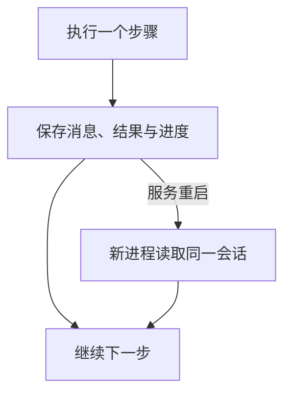

**让 Agent 重启后接着做，需要把消息、工具结果和执行进度存到进程外，再由新进程读回来。**

- 只要记住聊天，先把消息存进数据库。
- 还要接着完成工作，就要保存做到了哪一步，以及工具是否已经执行。
- 云端多实例可以先用 PostgreSQL，大文件放对象存储；不必为此立刻引入一整套新框架。

“状态外置”指的就是把这些恢复依据放到服务进程之外。保存整个 Agent 内存对象，通常没有必要。

## 用一次温度查询看懂恢复

假设用户问家庭助手“客厅多少度”，程序分三步处理。

```text
理解问题 → 调用温度工具 → 根据读数回复
```

工具已经返回 23.5°C，程序却在回复前重启了。此时能不能继续，取决于重启前保存了什么。

| 已经保存的数据 | 新进程能做什么 |
| --- | --- |
| 什么都没保存 | 不知道用户刚才问过什么 |
| 只保存用户的问题 | 可以重新查询，但不知道上一次已经查过 |
| 保存问题、工具结果和下一步 | 直接根据这次读数回复 |

恢复的目标，是让新进程知道这轮任务的事实和进度。它不需要找回原来的协程或数据库连接，更不能保证把一段尚未生成完的回答逐字接上。

下文的实验就使用这个流程。温度和模型决策是模拟的，保存与恢复使用真实的 LangGraph 和 PostgreSQL。

## 最小改法，先做好这三步

### 1. 给会话一个固定 ID，把数据放在共享存储

同一个用户的多次交互，通过会话 ID 串起来。在框架里它通常叫 `thread_id`。用户可以有多个会话，一次具体执行还可以有自己的 `run_id`，不要把用户、会话和执行都当成同一个对象。

最小的存储分工可以这样定。

| 保存什么 | 放在哪里 | 恢复时的用途 |
| --- | --- | --- |
| 消息与工具结果 | 数据库 | 找回问题、已经取得的结果及其顺序 |
| 当前进度和下一步 | 数据库 | 决定从哪里继续 |
| 文件、图片、大段原文 | 对象存储，数据库保存引用 | 找回实际内容，而不只剩一个失效链接 |

把“当前做到哪里，接下来做什么”保存下来，这份记录就叫检查点，英文是 Checkpoint。

```json
{
  "thread_id": "room-demo",
  "run_id": "run-42",
  "next_step": "reply",
  "messages_ref": "messages-of-run-42",
  "tool_result_ref": "temperature-result-7"
}
```

这是帮助理解的结构示意，实际项目还要加入所属用户、版本和权限信息。恢复时校验当前身份有权读取该会话，不能只凭拿到了 ID 就放行。

数据库必须独立于应用实例保存。把 SQLite 文件写在会被替换的容器里，仍然可能随容器消失。单机 SQLite 加持久卷可以跨进程恢复，多实例服务则可以优先使用共享数据库。[Kubernetes 卷的生命周期](https://kubernetes.io/docs/concepts/storage/volumes/#emptydir)

### 2. 做完一步就保存，不等整轮结束

对于温度查询，保存顺序可以直接写成下面这样。

```text
收到问题    保存用户消息，再确认已经接收
决定调用    保存工具名称、参数和调用 ID
拿到读数    保存工具结果，并记录下一步是回复
回复完成    保存最终消息，记录这轮已经结束
```

保存时只开短事务，调用模型和工具放在事务外。不要让数据库一直等远程请求返回。

工具结果还要能对应到哪次调用。例如请求带 `call-7`，返回结果也保留 `call-7`。同一轮可能调用多个工具，仅保存聊天窗口里的文字，会丢掉这种关联。按 SDK 要求保留结构化消息，恢复时才拼得出有效的模型输入。

### 3. 新进程读取进度，再决定要不要调用模型

启动新的执行进程后，用同一个会话 ID 读取检查点。下一步是回复，就加载问题和已保存的读数，再组织回答；下一步仍在等待审批，就继续等待。

如果历史很长，可以使用“较早历史的摘要 + 最近完整消息 + 本轮工具结果”，不用每次重发全部聊天记录。摘要要注明覆盖到哪一条，避免漏消息或重复拼接。本轮运行期间新来的消息，则按约定排队或打断处理，不要随手混进已经开始的执行。

**存好状态，也需要有人重新接手。** 可以由队列消费者或启动恢复程序领取未完成任务。单独配置一个保存检查点的库，不会自动增加一个常驻执行服务。



## 已有项目，怎么选实现方式

选择取决于要恢复到什么程度。

| 项目情况 | 建议起点 |
| --- | --- |
| 主要是聊天，每轮很短 | 保存完整消息、附件和请求去重记录 |
| 有多步 Agent，执行中要暂停或恢复 | 使用框架的持久化检查点，例如 LangGraph 加 PostgreSQL |
| 跨多个服务，长时间等待，重试流程复杂 | 评估现有任务系统或 Temporal 等持久化工作流 |

如果 Java 项目已经有任务表、队列和执行进程，可以直接补消息、工具操作记录和恢复入口，无须为了 Agent 重新选择语言。

LangGraph 的数据库检查点适合第二种情况。它保存图的执行状态，业务仍要负责权限、工具去重和恢复调度。[数据库接入示例](https://docs.langchain.com/oss/python/langgraph/add-memory#use-in-production)

Temporal 则记录执行历史，再通过重放工作流恢复。模型调用等结果不固定的操作应放到 Activity 中，也就是由工作流调度的实际工作步骤；重试时仍要防止重复业务动作。[Temporal 的恢复机制](https://docs.temporal.io/workflow-execution#replays)、[AI 工作流约束](https://go.temporal.io/platform-hub/ai-engineering/ai-patterns)

## 实际跑一次“退出进程，再继续”

[完整示例](/examples/agent-context-recovery.py)需要 Python 3.11 或更新版本，以及独立的 PostgreSQL 演示数据库。它不连接真实设备，也不调用付费模型。

<details>
<summary>准备环境、下载脚本和连接演示数据库</summary>

```bash
python3 -m venv .venv-agent-recovery
. .venv-agent-recovery/bin/activate
python -m pip install 'langgraph==1.2.11' \
  'langgraph-checkpoint-postgres==3.1.2' \
  'psycopg[binary,pool]==3.3.5'
curl -fsSLo agent-context-recovery.py \
  https://blog.mlxb.cc/examples/agent-context-recovery.py

# 粘贴独立演示库的连接串并回车，输入不显示在终端。
read -r -s AGENT_DEMO_DATABASE_URL
export AGENT_DEMO_DATABASE_URL
python agent-context-recovery.py setup
```

不要连接生产库，也不要把凭证写进 Git。云端数据库按服务商要求启用 TLS，并使用适当权限的账号。`setup` 负责初始化检查点表，线上应作为受控迁移执行，不要每次请求都建表。

</details>

准备好以后，执行这条命令。

```bash
python agent-context-recovery.py start \
  --thread recovery-demo-1 --crash-before-reply
```

程序完成工具查询，保存结果，然后在回复前直接退出。终端会显示下面的内容，退出码为 75，这是安排好的故障点。

```text
ENTER plan
ENTER tool (simulated read)
ENTER reply
CRASH before reply, exit=75 (no cleanup)
```

再启动新进程，读取状态并继续。

```bash
python agent-context-recovery.py status --thread recovery-demo-1
python agent-context-recovery.py resume --thread recovery-demo-1
```

恢复前应看到三条消息，分别是用户问题、工具调用和工具结果。待执行节点是 `reply`。恢复时只进入回复节点，最终根据模拟读数 23.5°C 生成第四条消息，前面的工具不重跑。

实现中有两个配置不能漏掉。一个是使用 PostgreSQL 的检查点，而非内存里的 `InMemorySaver`；另一个是恢复时继续传入相同的 `thread_id`。

```python
# 已完成配置的 graph 使用 PostgreSQL 保存检查点。
config = {"configurable": {"thread_id": "recovery-demo-1"}}
graph.invoke(None, config, durability="sync")
```

传入 `None` 表示继续已有运行，不再追加一次原始问题。`sync` 要求在进入下一步前保存检查点。若改成异步写入，进程退出时就可能还有状态没来得及保存；只在整轮退出时保存，则不能提供相同的中途恢复能力。[LangGraph 的持久化模式](https://docs.langchain.com/oss/python/langgraph/checkpointers#durability-modes)

这个实验覆盖的是**工具结果已经保存后，应用进程退出**。它没有证明任意时刻崩溃都不会重复动作，也没有验证数据库故障切换或多个执行进程同时接手。

## 最危险的情况，工具执行了但结果没保存

假设指令换成“把亮度再降低 10%”。设备已经执行，程序在保存结果之前退出。新进程只看到“准备调用”，不知道设备到底有没有动。

这时直接重试，亮度可能再次降低。

恢复时要把“结果未知”单独处理。已经确认成功的操作复用结果；确认没发出的可以执行；不确定的先查询外部状态。接口支持幂等键时，重试复用同一个标识，让同一业务操作不因重复请求而多执行一次。

框架的检查点和业务工具表也可能分两次提交。可以先保存工具操作结果，节点重试时按操作 ID 找回结果，再让框架补上检查点。不要以为先后调用两个保存函数，就相当于一个数据库事务。

节点内的代码也可能重跑。LangGraph 的 `interrupt()` 恢复时会重新进入所在节点，中断之前的通知、订单创建等动作可能再次执行。因此，重要外部操作要能够去重，或拆成有独立恢复边界的步骤。[中断恢复规则](https://docs.langchain.com/oss/python/langgraph/interrupts#rules-of-interrupts)

## 上线前，再补这些边界

### 前端断线，要能找回输出

服务重启会断开流式连接。数据库恢复和浏览器重连是两件事。

给输出消息固定 ID，客户端重连后查询当前消息或补收后续事件。SSE 是服务端持续向浏览器推送事件的一种方式，它的 `Last-Event-ID` 可以表明客户端收到了哪里，但服务端仍要保存可补发的事件或消息快照。[SSE 事件 ID](https://html.spec.whatwg.org/dev/server-sent-events.html)

还没生成完的半句话按草稿处理。没有保存每个片段时，重启后可以替换草稿，不能把半句当成完整回复接进下一轮。客户端重新发送输入也要按请求 ID 去重，避免创建两份任务。

### 新代码，要读得懂旧进度

给工作流和状态格式保存版本。新版本改了步骤名称、参数或审批顺序，旧任务应交给兼容代码继续，或经迁移后恢复。读不懂就明确暂停，不要静默从头执行。

发布前停止领取新任务、等待当前步骤保存，能减少故障，但强制终止或内存不足时未必有清理机会。状态不能只靠进程退出前的一次保存。

### 外部存储本身，也要有恢复保证

应用进程重启和数据库丢数据属于不同故障。Redis 的持久化策略、PostgreSQL 的提交配置及副本设置，会影响故障时可能损失多少数据，不能只检查代码里有没有调用 `save()`。[Redis 持久化](https://redis.io/docs/latest/operate/oss_and_stack/management/persistence/)、[PostgreSQL 提交保证](https://www.postgresql.org/docs/current/wal-async-commit.html)

文件通常先上传成功，再把稳定引用和进度一起存库。否则恢复时可能找到一条记录，却读不到它指向的文件。备份与清理也要同时考虑数据库、文件和派生摘要，避免只保住其中一部分。

<details>
<summary>为什么保存事实就能重建上下文，模型缓存又负责什么</summary>

Kleppmann 关于日志和数据系统的讨论，将持久化记录与可重建的派生数据分开。本文把这种思路应用到 Agent，保留消息、工具结果和进度，再重建本次需要的输入。它不要求项目立刻引入 Kafka 或完整的 Event Sourcing，也不意味着原文替 Agent 规定了具体方案。[Kleppmann 的原文](https://martin.kleppmann.com/2015/05/27/logs-for-data-infrastructure.html)

模型侧的 KV Cache 缓存推理中已经计算过的结果，主要帮助减少重复计算。它与应用的消息数据库分属不同层。供应商会话 ID 和缓存可以提速，但不应在没有核对保留期限和恢复语义的情况下，替代应用自己的业务记录。[KV Cache 的作用](https://huggingface.co/docs/transformers/cache_explanation)

摘要和向量索引同样可以帮助挑选上下文。已经发生的工具操作却需要确切记录，不能依靠相似度搜索猜它是否成功。

</details>

## 怎么验收，先看三个结果

- 重启前已经确认接收的输入，重启后仍然能找到。
- 已经保存的工具结果能够复用，执行位置没有回到起点。
- 工具结果未知时，系统会查询或暂停，不会悄悄重复高风险动作。

可以先在温度结果保存后结束进程，确认新进程只继续回复。再把故障点移到工具执行与保存之间，检查未知结果怎样处理。前一项验证能否接着做，后一项验证接着做时会不会做错。
