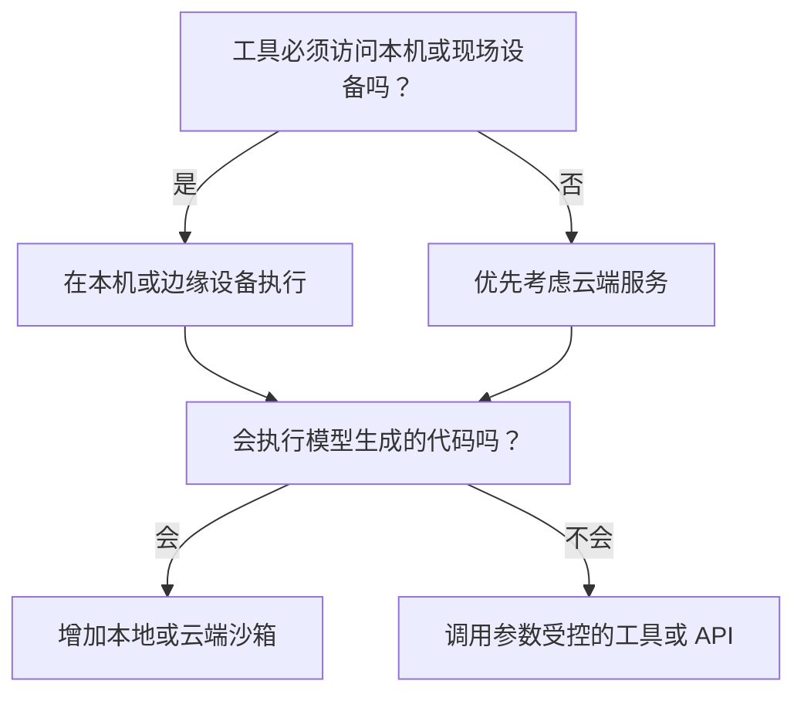

## 先说怎么选

**选择 Agent 的运行环境，先看四件事：它必须访问哪里的资源、会不会执行不可信代码、能不能依赖网络、任务中断后是否必须继续。**

- 必须操作用户电脑上的文件和软件，优先在本机运行。
- 面向大量用户，主要调用固定的业务接口，优先做成云端服务。
- 需要运行模型生成的代码，增加本地或云端沙箱。
- 必须控制家电、机器人等真实设备，把执行程序放在设备附近。
- 云端负责理解，本地负责操作，采用混合部署。

沙箱不是一种运行地点。**沙箱是一块受到限制的运行空间：程序只能访问允许的文件、网站和计算资源。** 它可以建在本机，也可以建在云端。因此“云端沙箱”的意思是程序在云端运行，同时又被限制在一个独立环境里。

调用云端模型，也不代表整个 Agent 都在云端。真正需要确定的是：哪段程序负责推进任务，工具又在哪台机器上执行。

## 几个词先讲清楚

| 词语 | 直白解释 |
| --- | --- |
| Agent 主程序 | 反复调用模型和工具，并决定下一步做什么的程序，也常叫 Harness |
| 工具 | 真正读文件、运行命令、访问网页或控制设备的程序 |
| 沙箱 | 与其他程序隔开的受限环境，只能访问允许的文件、网络和资源 |
| 边缘设备 | 靠近传感器、家电或机器运行的电脑，例如家庭服务器和工业网关 |
| 任务记录 | 消息、工具结果和执行进度，程序重启后靠它继续任务 |

容器和虚拟机是实现隔离的技术，沙箱是最终要达到的限制效果。只把 Agent 放进 Docker，并不代表文件、网络和密钥已经安全隔离。[NIST 容器安全指南](https://csrc.nist.gov/pubs/sp/800/190/final)

## 先排除不能用的方案

技术选型不必一上来给所有方案打分。先检查硬性条件，不能满足的方案直接排除。

| 硬性条件 | 对选型的影响 |
| --- | --- |
| 数据不能离开本地或公司内网 | 排除纯云端执行 |
| 必须操作本机软件和文件 | 需要本机 Agent，或者留一个本地执行程序 |
| 必须断网工作 | 需要本地或边缘能力 |
| 会运行模型生成的代码 | 需要沙箱，不能直接在业务服务器上执行 |
| 要控制真实设备 | 最后的状态检查和操作必须在设备附近完成 |
| 任务要运行很久 | 任务记录不能只放在运行进程的内存里 |

可以把判断过程压缩成下面这张图。



硬性条件处理完以后，通常只剩两三个可行方案。再比较开发成本、运行费用、可靠性和安全性，才有实际意义。

## 剩下的方案，怎样权衡

### 本机运行：直接使用用户现有环境

本机 Agent 适合个人编程助手、桌面自动化和需要读取私人文件的工具。Claude Code 就安装在开发者电脑上，可以修改本地项目和运行本机命令；模型处理需要连接 Anthropic。[Claude Code 安装要求](https://docs.anthropic.com/en/docs/claude-code/getting-started)

它的好处是启动快，能直接使用电脑上已经装好的软件。代价是权限可能过大，电脑休眠或关机后任务会中断，不同用户的系统环境也很难保持一致。

如果 Agent 只读指定目录、调用少量固定工具，可以用操作确认和目录权限限制风险。如果它会执行模型生成的 Shell 或代码，应该再加本地沙箱。Claude Code 的沙箱会限制文件和网络访问，超出范围时再询问用户。[本地沙箱机制](https://www.anthropic.com/engineering/claude-code-sandboxing)

### 云端服务：适合大量用户和固定业务接口

客服、知识库、审批助手通常不需要一台可以随意运行命令的电脑。Agent 主程序作为后端服务运行，通过预先开发好的接口查询订单、搜索资料或提交审批即可。

这种方式容易统一发布和扩容，但必须做好用户数据隔离、接口权限、失败重试和任务恢复。Google Agent Runtime 提供托管运行、会话和观测能力；Microsoft Foundry 既能运行配置式 Agent，也能托管开发者自己的 Agent 程序。[Google 官方资料](https://docs.cloud.google.com/gemini-enterprise-agent-platform/scale)、[Microsoft 官方资料](https://learn.microsoft.com/en-us/azure/ai-services/agents/overview)

如果所有工具都是参数受控的业务接口，就不必为了“更像 Agent”而给每个请求创建虚拟机。普通服务权限仍然要按用户检查，沙箱不能代替业务授权。

### 云端沙箱：适合运行代码、浏览器和临时文件

云端沙箱会为一次任务或一个会话准备独立的容器或轻量虚拟机。Agent 可以在里面拉取代码、安装依赖、运行测试和生成文件，但不能随意访问其他任务的数据或宿主服务器。

GitHub Copilot Cloud Agent 默认在 GitHub Actions 提供的临时开发环境里处理代码。[GitHub 官方说明](https://docs.github.com/en/copilot/how-tos/copilot-on-github/customize-copilot/customize-cloud-agent/customize-the-agent-environment) AWS AgentCore 可以给每个会话分配独立的轻量虚拟机，并明确说明里面的内存和磁盘默认只在这台虚拟机存活期间有效。[AWS 会话隔离](https://docs.aws.amazon.com/bedrock-agentcore/latest/devguide/runtime-sessions.html)

沙箱缩小了错误命令可能影响的范围，也带来了启动等待、重复安装依赖和计算费用。常见做法是准备固定基础镜像，用快照或预热环境缩短启动时间；把提交、文件和任务记录保存到沙箱之外；限制 CPU、内存、运行时间和可访问网站。E2B 提供的是这类隔离运行环境，不是 Agent 框架。[E2B](https://e2b.dev/)

### 边缘运行：适合断网、低延迟和真实设备

边缘 Agent 运行在家庭服务器、机器人或工业网关上。它离传感器和设备近，网络断开时仍能完成已经准备好的本地操作。代价是算力有限、硬件型号多、升级麻烦，而且一次错误操作可能真的打开门锁或启动机器。

Home Assistant Assist 可以完全运行在自己的硬件上，也可以只把语音或复杂理解交给云端，设备控制仍由家里的 Home Assistant 完成。[本地运行说明](https://www.home-assistant.io/voice_control/)、[云端语音方案](https://www.home-assistant.io/voice_control/voice_remote_cloud_assistant/)

落地时让固定规则和脚本执行设备操作。执行前重新读取最新状态并校验参数，执行后再确认设备是否真的变化。云端不可用时，只保留已经证明安全的本地能力。

### 混合部署：云端理解，本地执行

混合部署会把 Agent 主程序、工具和任务记录放在不同地方。例如云端负责理解用户要求，家庭服务器负责控制家电；或者云端安排代码任务，再交给客户内网中的执行程序处理。

它能同时使用云端算力和本地资源，但网络可能在任何一步中断。工具已经执行成功、云端却没收到结果时，不能直接再做一次。给每次操作分配固定编号，重试前先查询原来的结果，避免重复发邮件、重复扣款或重复控制设备。

Anthropic 的 Managed Agents 把任务记录、Agent 主程序和沙箱分开：沙箱坏了可以重建，主程序坏了可以读取任务记录继续。[Anthropic 架构说明](https://www.anthropic.com/engineering/managed-agents) 跨越多台机器时，还应使用同一个追踪编号串起模型请求、工具调用和执行结果。[OpenTelemetry Trace](https://opentelemetry.io/docs/concepts/signals/traces/)

## 三个项目怎么选

### 企业客服 Agent

条件是用户多，主要查询知识库和订单接口，不运行任意代码，还需要统一监控。

**选择云端服务。** 消息和任务进度保存在数据库，工具通过固定接口调用，不需要为每次问答创建代码沙箱。

### 编程 Agent

个人开发时，如果 Agent 必须使用电脑上现成的项目、数据库和编译环境，可以选择本机运行，并用本地沙箱限制目录和网络。

团队把任务交给 Agent 后，希望它独立拉取代码、安装依赖、运行测试并提交结果，更适合云端沙箱。代价是需要准备可重复安装的开发环境，并按任务支付计算费用。

### 家庭助手

家庭助手通过 Skill 告诉 Agent 有哪些能力，通过固定脚本控制 Home Assistant，避免让模型临时编写控制代码。设备和最新状态都在家里，因此控制脚本应留在家庭服务器。

模型也在家庭服务器上运行时，这是边缘部署；模型调用云端服务时，这是混合部署。无论模型在哪里，开空调、开门锁等操作都由本地脚本重新检查条件后执行。

## 最后用五个问题确认

1. Agent 必须访问哪里的文件、软件、数据或设备？
2. 数据能不能离开本机或公司内网？
3. 工具会不会执行模型生成的代码？
4. 能不能接受断网后停止工作？
5. 任务中断后，是否必须从原来的进度继续？

对应关系很直接：

```text
访问本机资源          → 本机运行
大量用户 + 固定接口   → 云端服务
执行不可信代码        → 增加沙箱
控制真实设备          → 边缘执行
云端理解 + 本地操作   → 混合部署
```

选择完成后，还要单独设计任务恢复。只要任务可能跨过一次进程重启，就把消息、工具结果和当前进度保存到运行进程之外。需要持续几小时或几天的任务，可以使用能根据记录继续执行的任务系统。[Temporal 官方文档](https://docs.temporal.io/)

<details>
<summary>本文核对的主要资料</summary>

- [Anthropic：Scaling Managed Agents](https://www.anthropic.com/engineering/managed-agents)
- [Anthropic：Claude Code Sandboxing](https://www.anthropic.com/engineering/claude-code-sandboxing)
- [GitHub：配置 Copilot Cloud Agent 的临时开发环境](https://docs.github.com/en/copilot/how-tos/copilot-on-github/customize-copilot/customize-cloud-agent/customize-the-agent-environment)
- [AWS：AgentCore Runtime 会话隔离](https://docs.aws.amazon.com/bedrock-agentcore/latest/devguide/runtime-sessions.html)
- [Google：Agent Runtime、Sessions 与 Memory Bank](https://docs.cloud.google.com/gemini-enterprise-agent-platform/scale)
- [Microsoft：Foundry Agent Service](https://learn.microsoft.com/en-us/azure/ai-services/agents/overview)
- [Home Assistant：Assist](https://www.home-assistant.io/voice_control/)
- [NIST SP 800-190：Application Container Security Guide](https://csrc.nist.gov/pubs/sp/800/190/final)
- [Temporal：持久化工作流](https://docs.temporal.io/)
- [OpenTelemetry：Traces](https://opentelemetry.io/docs/concepts/signals/traces/)

</details>

继续阅读：[服务重启后，Agent 怎么记得前文并接着做](/ai/agent-context-persistence-recovery/) · [Agent 感知环境变化，怎样用好 LLM 缓存](/ai/agent-environment-awareness-llm-cache/)
