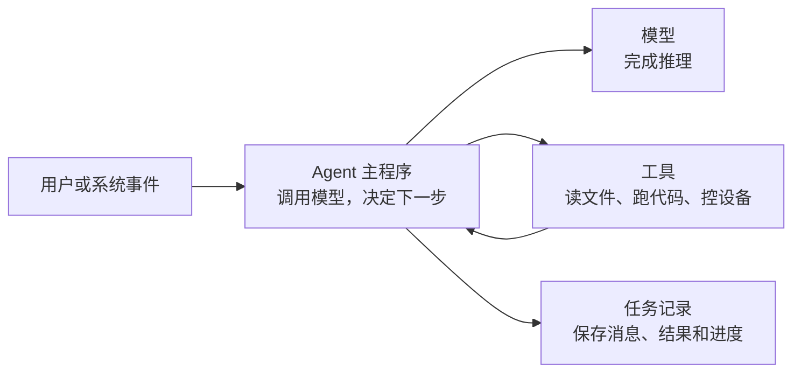

## 核心概要

**把 Agent 按运行环境分类，先看负责推进任务的主程序运行在哪里。** 这段程序会调用模型、接收工具结果、决定下一步，通常叫 Agent Harness。它可能运行在用户电脑、家庭网关或云端服务器上。

调用云端模型，不等于整个 Agent 都在云端；用户在网页里聊天，也不等于 Agent 运行在浏览器里。还要继续看工具在哪里执行、任务记录存在哪里，以及运行代码有没有被隔离。

工程上常见六种说法：本地进程型、本地沙箱型、云端服务型、云端沙箱型、边缘设备型和混合分布型。它们不是互相排斥的等级。例如一个 Agent 可以由云端主程序负责安排任务，再把代码交给独立的云端沙箱执行。

## 先看三个真实产品

### Claude Code：程序在本地，模型在云端

Claude Code 安装在开发者电脑上。它可以读取项目、修改文件、运行本机命令；AI 处理需要连接 Anthropic。因为负责推进任务的程序和主要工具都在用户电脑上，所以它属于本地 Agent，不会因为调用云端模型就变成云端 Agent。[Claude Code 安装要求](https://docs.anthropic.com/en/docs/claude-code/getting-started)

### GitHub Copilot Cloud Agent：任务在云端临时环境里完成

GitHub Copilot Cloud Agent 默认使用 GitHub Actions 提供的临时开发环境。它在里面读取代码、修改文件并运行测试。任务结束后，这个环境不会被当成长久保存资料的电脑使用，因此需要把提交、日志和其他成果保存到环境之外。[GitHub 官方说明](https://docs.github.com/en/copilot/how-tos/copilot-on-github/customize-copilot/customize-cloud-agent/customize-the-agent-environment)

这是一种典型的云端沙箱 Agent：程序和工具都在云端运行，而且每项任务受到独立环境的限制。

### Home Assistant Assist：控制留在家里，部分处理可以上云

Home Assistant Assist 可以完全运行在自己的硬件上。它也可以把语音识别、语音合成或大模型推理交给云端，而开灯、开锁和执行自动化仍由家里的 Home Assistant 完成。[本地运行说明](https://www.home-assistant.io/voice_control/)、[云端语音方案](https://www.home-assistant.io/voice_control/voice_remote_cloud_assistant/)

如果理解语言的工作在云端，控制设备的脚本在家里，这就是混合部署。把模型放在哪里，与把设备控制程序放在哪里，是两个不同的选择。

## 判断运行方式，要看五样东西

图里的程序可能都在同一台机器，也可能分布在几个地方。判断时依次回答下面五个问题。

| 要找的东西 | 需要回答的问题 |
| --- | --- |
| Agent 主程序 | 哪段程序负责调用模型、接收工具结果并决定下一步？ |
| 模型 | 推理发生在本机、自己的服务器，还是第三方云服务？ |
| 工具 | 文件、Shell、浏览器、业务接口和设备分别在哪里操作？ |
| 任务记录 | 服务重启后，消息、工具结果和当前进度从哪里找回来？ |
| 隔离环境 | 模型生成的代码能访问哪些文件和网站？任务结束后环境是否销毁？ |

这种拆法参考了 David Parnas 的模块化原则：把会独立变化的部分分开，系统才容易理解和修改。[ACM 原始论文](https://doi.org/10.1145/361598.361623) 应用到 Agent 后，更换模型不必同时迁移工具；更换沙箱，也不该让任务记录跟着丢失。

## 六种常见运行方式

- **本地进程型**：主程序和工具都在用户电脑，例如 Claude Code。
- **本地沙箱型**：主程序在用户电脑，工具只能访问限定的目录和网站。
- **云端服务型**：主程序作为云端服务运行，例如 Google Agent Runtime、Microsoft Foundry。
- **云端沙箱型**：每个任务或会话使用独立的云端环境，例如 GitHub Copilot Cloud Agent、AWS AgentCore。
- **边缘设备型**：主程序运行在家庭网关、机器人或现场设备，例如 Home Assistant Assist。
- **混合分布型**：主程序、工具和记录分散在本地、云端或客户内网。

这张表是方便沟通的归纳，不是行业统一标准。同一个产品可能同时符合两项。例如 AWS AgentCore 既是云端托管服务，也能给每个会话分配独立的轻量虚拟机。

### 本地进程型：离资料最近，也最容易碰到用户隐私

本地 Agent 可以直接使用项目文件、终端和已经安装的开发工具，文件操作不必先经过云端。代价是它可能接触 SSH 密钥、浏览器资料和私人文件；电脑休眠、关机或进程退出，任务也可能中断。

落地时要把可访问目录限制在项目范围，高风险命令继续要求确认，并把任务进度写入磁盘。浏览器扩展还要接受后台程序会被系统停止这一事实。Chrome 明确要求扩展不要依赖全局变量保存状态，而应使用持久化存储。[Chrome 后台生命周期](https://developer.chrome.com/docs/extensions/develop/concepts/service-workers/lifecycle)

### 本地沙箱型：仍在本机，但不能随便碰整台电脑

本地沙箱会限制 Agent 能读写的目录和能够访问的网站。Claude Code 的沙箱同时限制文件系统和网络；命令超出范围时，再交给用户决定是否放行。[Claude Code 沙箱机制](https://www.anthropic.com/engineering/claude-code-sandboxing)

主要难点是兼容性。某些编译器、数据库和本地 MCP 服务需要访问沙箱外的资源，完全封死会让工具不能用。常见做法是只允许访问需要的工作目录，网络默认拒绝、按域名放行；登录密钥放在沙箱外，由专门的代理程序代替 Agent 完成认证。

### 云端服务型：容易统一管理，但必须处理多用户和长任务

这类 Agent 像普通后端服务一样运行。Google Agent Runtime 提供托管运行、会话、记忆和观测能力；Microsoft Foundry 可以运行只配置指令和工具的 Prompt Agent，也可以运行开发者提供的容器程序。[Google 官方资料](https://docs.cloud.google.com/gemini-enterprise-agent-platform/scale)、[Microsoft 官方资料](https://learn.microsoft.com/en-us/azure/ai-services/agents/overview)

真正困难的不是把程序启动起来，而是让多个用户互不串数据，让任务在扩缩容和重启后继续，还要避免同一个操作被重复执行。常见方案是把消息、工具结果和进度保存在独立数据库中，通过任务队列分发工作。一个执行进程坏了，新进程读取记录后接着处理。跨越很长时间的步骤，可以交给持久化工作流系统；Temporal 就把故障后继续执行作为核心能力。[Temporal 官方文档](https://docs.temporal.io/)

### 云端沙箱型：适合执行不可信代码，环境不能当数据库

云端沙箱通常为每个任务或会话创建容器、轻量虚拟机或完整虚拟机。AWS AgentCore 可以让每个会话使用独立的轻量虚拟机，并明确说明里面的内存和磁盘默认只在计算环境存活期间有效。[AWS 会话隔离](https://docs.aws.amazon.com/bedrock-agentcore/latest/devguide/runtime-sessions.html)

这种方式能缩小错误命令造成的影响，但会带来启动等待、重复安装依赖和运行成本。常见方案是准备固定基础镜像，用快照或预热环境缩短启动时间；成果写入对象存储或代码仓库；限制 CPU、内存、运行时间和可访问网站。E2B 提供的就是每个会话一台隔离 microVM 的基础设施，它本身不是 Agent 框架。[E2B](https://e2b.dev/)

容器也不能自动等同于安全沙箱。镜像、宿主机、网络、密钥和权限仍然需要单独检查。[NIST 容器安全指南](https://csrc.nist.gov/pubs/sp/800/190/final)

### 边缘设备型：要在断网和真实设备状态下工作

边缘 Agent 运行在家庭网关、机器人、汽车或工业现场设备上。它的优势是离摄像头、传感器和执行设备近，网络断开时仍能完成部分任务。难点是算力有限、设备型号多、升级困难，而且一次错误操作可能真的打开门锁或启动机器。

落地时可以让固定规则和脚本先处理明确指令，把复杂理解交给本地小模型或云端模型。控制设备前，执行脚本重新读取当前状态并校验参数；执行后再确认设备是否真的变化。云端不可用时，只保留已经证明安全的本地能力，而不是让模型在信息不足时继续猜。

### 混合分布型：能力最灵活，排查问题也最麻烦

混合 Agent 会把任务安排、模型推理、工具执行和记录保存放在不同环境。Anthropic 的 Managed Agents 把任务记录、Agent 主程序和沙箱拆开：沙箱坏了可以重新创建，主程序坏了可以从任务记录恢复。[Anthropic 架构说明](https://www.anthropic.com/engineering/managed-agents)

组件分开以后，网络可能在任何一步中断。工具已经执行成功，但云端没收到结果时，不能直接再做一次。给每个操作分配固定编号，重复请求先查原来的结果；这类设计通常叫幂等。访问客户内网或家庭设备时，凭据只授予当前任务需要的权限，不把长期密钥交给沙箱。

日志还要能串起整次任务。OpenTelemetry 的 Trace 可以用同一个追踪编号关联不同进程和服务器中的操作，帮助定位到底是模型、网络还是工具出了问题。[OpenTelemetry Trace](https://opentelemetry.io/docs/concepts/signals/traces/)

## 选运行方式，先回答六个问题

| 项目条件 | 更值得优先考虑的方式 |
| --- | --- |
| 必须直接操作用户电脑上的文件和软件 | 本地进程或本地沙箱 |
| 需要执行模型生成的代码 | 本地沙箱或云端沙箱 |
| 用户多，需要统一管理和扩缩容 | 云端服务 |
| 必须断网可用、低延迟或控制现场设备 | 边缘设备 |
| 任务可能运行很久，必须跨重启继续 | 把任务记录保存在进程之外，再由任务系统读取记录继续执行 |
| 工具分布在电脑、云端和内网 | 混合部署，并补齐身份、重试和追踪机制 |

运行位置不是能力等级。本地 Agent 不一定简单，云端 Agent 也不一定可靠。先看数据和工具在哪里，再决定把 Agent 主程序部署在能直接访问这些资源的地方，还是通过受控接口远程调用。

## 用一句话描述自己的 Agent

以后介绍一个 Agent，可以直接填这句话：

> 负责推进任务的程序运行在＿＿；模型运行在＿＿；工具在＿＿执行；消息和任务进度保存在＿＿；执行代码受到＿＿限制；任务结束后，运行环境会／不会被销毁。

例如，家庭助手的主程序如果运行在家庭服务器，调用云端模型，通过固定脚本控制同一网络中的 Home Assistant，任务记录也保存在家里，那么它是**边缘 Agent 加云端模型**。如果主程序搬到云端，只把设备控制脚本留在家里，它就变成了**混合 Agent**。

名称只是结果。真正决定落地难度的，是前面这些程序和数据究竟放在哪里。

本文核对的主要资料

- [David Parnas：On the Criteria To Be Used in Decomposing Systems into Modules](https://doi.org/10.1145/361598.361623)
- [Anthropic：Scaling Managed Agents](https://www.anthropic.com/engineering/managed-agents)
- [Anthropic：Claude Code Sandboxing](https://www.anthropic.com/engineering/claude-code-sandboxing)
- [GitHub：配置 Copilot Cloud Agent 的临时开发环境](https://docs.github.com/en/copilot/how-tos/copilot-on-github/customize-copilot/customize-cloud-agent/customize-the-agent-environment)
- [AWS：AgentCore Runtime 会话隔离](https://docs.aws.amazon.com/bedrock-agentcore/latest/devguide/runtime-sessions.html)
- [Google：Agent Runtime、Sessions 与 Memory Bank](https://docs.cloud.google.com/gemini-enterprise-agent-platform/scale)
- [Microsoft：Foundry Agent Service](https://learn.microsoft.com/en-us/azure/ai-services/agents/overview)
- [Home Assistant：Assist](https://www.home-assistant.io/voice_control/)
- [Chrome：Extension Service Worker 生命周期](https://developer.chrome.com/docs/extensions/develop/concepts/service-workers/lifecycle)
- [NIST SP 800-190：Application Container Security Guide](https://csrc.nist.gov/pubs/sp/800/190/final)
- [Temporal：持久化工作流](https://docs.temporal.io/)
- [OpenTelemetry：Traces](https://opentelemetry.io/docs/concepts/signals/traces/)

继续阅读：[服务重启后，Agent 怎么记得前文并接着做](/ai/agent-context-persistence-recovery/) · [Agent 感知环境变化，怎样用好 LLM 缓存](/ai/agent-environment-awareness-llm-cache/)
