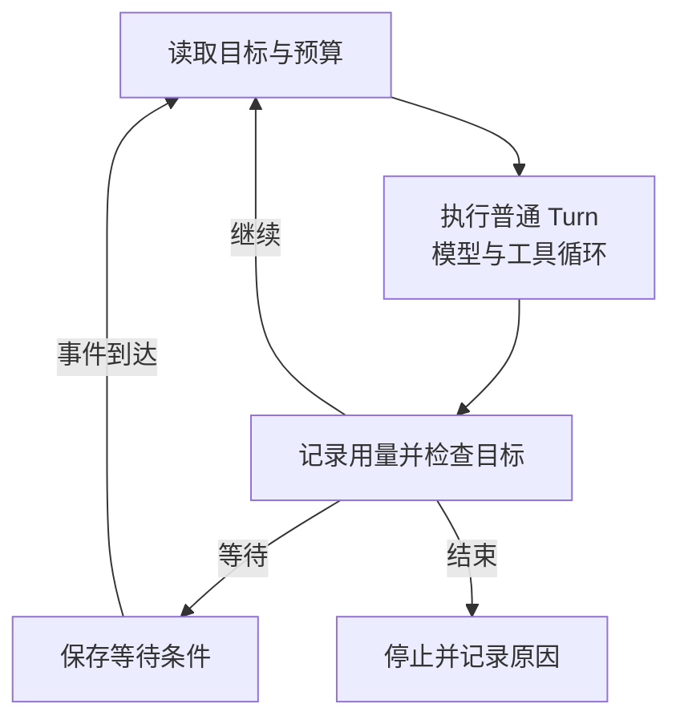

给普通 Agent 发一句“做到完成为止”，它也能连续改代码、调用工具、修复测试。再打开一个叫 Goal 的功能，屏幕上依然是这些动作，体感没有明显差别很正常。

差别通常在一轮工作结束以后。普通任务可以把控制权交还给用户。目标模式还要检查目标状态，决定要不要再启动一轮、等待外部结果，或者停下来。模型仍然可能是同一个，工具也可以完全复用。

不过，各家的“目标”实现并不相同。Codex 有持久化的目标状态和续跑调度；Claude Code 的 `/goal` 用独立模型判断停止条件；Ralph Loop 可以靠 Stop hook 把原始任务重新送回去。这些机制都能延长执行，但给出的完成保证不同。

这篇先沿着公开实现把边界讲清，再设计一个自己的目标控制器。文中的生产方案属于工程设计建议，不代表任何一家产品已经具备全部能力。附带的小实验不需要 API Key，可以直接看到提前报喜为什么会被拒绝，以及续跑、暂停和预算限制怎样生效。

## 一轮到底有多长

Harness 是模型外面负责运行 Agent 的程序。它管理上下文、工具调用、权限、事件和执行生命周期。同一个模型放进不同的 Harness，能否并发执行、怎样恢复任务、什么时候停下来，都可能不同。

讨论目标之前，需要约定几个容易混用的词。

| 概念 | 本文中的含义 |
| --- | --- |
| 模型调用 | 向模型发送一次请求，获得文本或工具调用等输出 |
| 工具循环 | 模型调用工具，Harness 执行并返回结果，再让模型决定下一步 |
| Turn，一轮执行 | 从某次输入或系统事件启动，到交还控制权的一段工作，里面可以包含很多次模型调用 |
| Session，会话 | 保存多轮执行的历史与运行上下文，具体持久化方式由产品决定 |
| Goal，目标 | 跨轮保存的完成条件及其运行状态，可以继续存在于当前 Turn 结束以后 |

各框架命名不完全一致，但分析时要分清这些边界。一次终端命令可以包含多轮执行，一条用户消息也可以引发几十次工具调用。不能用“我只点了一次运行”判断里面有没有目标控制器。

普通 Agent 也可以有计划、上下文压缩和会话恢复。这些能力解决怎样继续工作，并不自动回答工作是否满足了用户的全部要求。以 OpenCode 为例，官方说明普通 Agent 默认可以持续迭代，直到模型选择停止或用户中断，也可以通过 `steps` 设置上限。仅有这样的循环，还不能推导出独立的目标验收机制。[OpenCode 的迭代上限](https://opencode.ai/docs/agents/#max-steps)

目标模式可以画成套在工具循环外面的一层判断。



如果第一轮已经完成要求，外面这一层检查几乎不可见。只有遇到遗漏、等待、预算耗尽或者提前停止，差别才会显露出来。

## Codex 的源码实际做了什么

这里固定到公开标签 `rust-v0.135.0`，对应提交 `4daceea869704f9f35e0a3949fc34711ef978a4e`。桌面端的入口、开关和具体版本可能不同，下面讨论这份源码能证明的运行机制。

在 `core/src/tasks/mod.rs` 中，一轮结束后会处理目标相关事件。清理当前活动轮次后，运行时可以进入 `MaybeContinueIfIdle`。随后 `core/src/goals.rs` 中的 `maybe_start_goal_continuation_turn()` 尝试启动目标续跑。[轮次结束处理](https://github.com/openai/codex/blob/4daceea869704f9f35e0a3949fc34711ef978a4e/codex-rs/core/src/tasks/mod.rs)、[目标运行时](https://github.com/openai/codex/blob/4daceea869704f9f35e0a3949fc34711ef978a4e/codex-rs/core/src/goals.rs)

这条路径并没有直接无条件地再问一次模型。它先检查目标功能是否开启、是否处于需要忽略目标的模式、有没有正在执行的轮次、有没有排队的输入，以及数据库中的目标是否仍为 `Active`。准备好续跑以后，还会重新读取目标 ID 和状态，拒绝目标已被替换或不再为 `Active` 的候选续跑。这项检查没有包含下文自建方案中的完整修订号校验。

通过检查后，它把目标续跑信息放进输入队列，创建新的 Turn，最终调用的仍是普通任务。

```rust
self.start_task(turn_context, Vec::new(), RegularTask::new())
    .await;
```

这行代码足以解释“看起来和普通任务没区别”的一大部分原因。两种模式复用了执行器，差别落在谁启动下一轮、携带什么目标信息，以及什么时候允许停止。

续跑模板要求检查权威状态、核对完整目标、做必要验证，再更新目标状态。公开的 `update_goal` 处理器接收模型提交的 `complete` 或 `blocked` 并更新状态。这条完成路径没有另外启动一个独立验收模型，也没有在处理器里自动运行项目测试。[续跑提示模板](https://github.com/openai/codex/blob/4daceea869704f9f35e0a3949fc34711ef978a4e/codex-rs/core/templates/goals/continuation.md)、[状态更新处理器](https://github.com/openai/codex/blob/4daceea869704f9f35e0a3949fc34711ef978a4e/codex-rs/core/src/tools/handlers/goal/update_goal.rs)

因此，对这份实现比较准确的描述是，Harness 保存目标、管理续跑与限制，主 Agent 按指令自查并报告完成。不能因为出现了 Goal，就顺带宣称它有一个独立裁判保证结果正确。

## 其他 Harness 怎么做

Claude Code 的官方文档给出了另一种明确实现。`/goal` 包装了一个会话级的 prompt-based Stop hook。没有后台任务尚未完成时，它在轮次结束后让单独的小型模型根据完成条件和对话记录，返回未满足、已满足或不可能满足，再决定继续还是清除目标。这个评估器不调用工具，无法自行读取仓库或重跑测试。它能判断的范围，受执行器已经展示的证据限制。[Claude Code Goal 的评估机制](https://code.claude.com/docs/en/goal#how-evaluation-works)

后台工作仍在运行时，评估会暂缓。如果连续几轮没有工具调用、只是在回复评估器，也可能停止循环并交还控制权，同时保留目标。因此，目标仍为活动状态，不一定表示当前正在消耗模型请求。

Ralph Loop 的官方插件更直接。Stop hook 读取状态文件，检查迭代上限和完成标记；没有触发停止条件时，就递增计数并把原始任务重新送回去。完成标记是输出文本里的约定字符串，存在这个字符串不等于外部验收通过。[Ralph Loop 的 Stop hook 源码](https://github.com/anthropics/claude-plugins-official/blob/85cce0381e7860082641b59d961a2b8c368b8b79/plugins/ralph-loop/hooks/stop-hook.sh)

把这些实现放到一起，比较的对象就清楚了。

| 实现 | 下一轮由谁发起 | 怎样判断停止 | 不能顺带推导的保证 |
| --- | --- | --- | --- |
| 普通工具循环 | 当前执行器继续请求模型 | 模型结束、用户中断或达到上限 | 全部需求均无遗漏 |
| Codex 上述版本的 Goal | 目标运行时在空闲时调度 | 目标状态、预算等限制，模型报告完成或阻塞 | 有独立验收模型兜底 |
| Claude Code `/goal` | 会话级 Stop hook 的判断 | 独立模型读取对话后给出结论 | 评估器亲自验证了外部状态 |
| Ralph Loop | Stop hook 阻止退出并重新注入任务 | 完成标记或最大迭代次数等 | 完成标记可信、业务已经成功 |
| 自建验收型控制器 | 调度器根据状态和事件发起 | 预先定义的验收器、预算及人工决策 | 验收规则能自动覆盖所有需求 |

LangGraph 解决了另一部分问题。持久化 Checkpointer 可以保存图的执行状态，供后续恢复；使用仅存内存的实现，进程结束后就没有这项保证。恢复也可能涉及步骤重放，外部副作用仍要单独处理。开发者可以在图里添加目标判断和验收节点，但 Checkpointer 本身不会替应用定义“完成”。[LangGraph 持久化](https://docs.langchain.com/oss/python/langgraph/persistence)、[Checkpointer 选择](https://docs.langchain.com/oss/python/langgraph/checkpointers)

选框架时，我会把自动续跑、完成验收、故障恢复分别核对。一个产品拥有其中一项，不代表其余两项也具有相同强度。

## 自己实现时，先把目标写成可以判定的约定

下面用一个假设任务贯穿设计。要把两个页面的页脚年份统一成 2026，正文必须保持不变。生产场景可以换成 API 迁移、批量修复链接，或者处理一批客服工单，控制过程类似。

只有一句自然语言目标，模型很容易把“我已经改了几个文件”当成结束条件。控制器需要另外保存验收范围、限制和证据要求。

```json
{
  "goal_id": "footer-2026",
  "revision": 1,
  "objective": "统一首页与关于页的页脚年份",
  "scope": ["/", "/about/"],
  "acceptance": [
    { "checker": "footer-year", "expected": 2026 },
    { "checker": "body-unchanged", "baseline": "snapshot-v1" }
  ],
  "permissions": { "edit": true, "publish": false },
  "limits": { "max_turns": 4, "max_cost_usd": 1.0 }
}
```

这里的轮数和金额只是示例配置。`checker` 指向服务端已注册的检查器，不是让模型随意生成一段 shell，再由高权限服务执行。范围和验收条件应在执行前得到用户或业务方确认。

`revision` 是目标修订号。用户中途把年份改成 2027，修订号就递增，针对 2026 得到的验收结果不能继续提交成功。即使目标文本没变，只要允许修改的范围、基线或验收规则变了，也应使旧证据失效。

我会允许 Agent 提交 `claimed_complete`，表达它认为工作已经完成。但只有控制器可以写入 `SUCCEEDED`。前者是待检查的声明，后者是系统根据约定作出的判定。

## 把状态和执行阶段分开

目标状态回答还能不能继续，执行阶段回答当前忙什么。把所有信息塞进一个 `running`，页面上就分不清它是在调用模型、等待人工批准，还是根本没有工作进程接手。

| 目标状态 | 意义及后续动作 |
| --- | --- |
| `ACTIVE` | 允许调度，阶段可以是执行或验收 |
| `WAITING` | 等待已知事件，保存审批单或外部任务 ID，事件到达后重新检查 |
| `PAUSED` | 用户暂停，需要明确恢复操作 |
| `BLOCKED` | 需要新的信息或权限，当前无法安全推进 |
| `BUDGET_LIMITED` | 达到用量或轮数限制，不能自动换个目标绕过 |
| `SUCCEEDED` | 当前版本的验收通过 |
| `FAILED` / `CANCELLED` | 已失败或取消，禁止迟到结果重新激活 |

这是本文建议的状态模型，和前面各产品的状态枚举没有一一对应关系。

`WAITING` 应该携带 `wait_reason`、`external_job_id` 和截止时间。例如部署平台正在构建，就订阅这个构建的完成事件。没有必要反复启动模型，让它重复说“仍在构建”。定时扫描可以用来补偿丢失的事件，但应有退避和最大等待时间。

`BLOCKED` 也不能按“连续失败三次”一刀切。缺少发布权限要尽早向用户说明；临时限流可以延迟重试；编译失败可能需要修改方案。错误类别决定后续动作，重试次数只提供保护上限。

## 先跑一个不花模型费用的小实验

完整代码只有一个文件，可以[查看或下载演示脚本](/examples/harness-goal-loop.mjs)。需要 Node.js 24 或更新版本，部分版本会显示 SQLite 实验性 API 提示，不影响下面的控制流程。

它用 SQLite 保存两个页面的数据快照、目标状态、轮数和已处理事件。执行器是确定性的模拟函数，每轮只修一个页面，却每次都声称完成。验收器独立检查两个页面的年份和正文，故意让这个过早的完成声明第一次无法通过。

```bash
curl -fsSLo harness-goal-loop.mjs https://blog.mlxb.cc/examples/harness-goal-loop.mjs
# 可以先阅读脚本；它只操作下面新建的临时数据库，不调用模型或网络。
goal_demo_dir=$(mktemp -d)
node harness-goal-loop.mjs init "$goal_demo_dir/goal.sqlite"
node harness-goal-loop.mjs tick "$goal_demo_dir/goal.sqlite" event-1
```

第一轮结果里，`claimedComplete` 为 `true`，但 `evidence.passed` 为 `false`。失败项明确指出 `/about/` 的年份没有更新，目标仍为 `ACTIVE`，已用轮数为 1。

这时每个命令都是一个独立进程。试着重复投递事件，再暂停和恢复。

```bash
# 同一个已处理事件不会再执行一轮。
node harness-goal-loop.mjs tick "$goal_demo_dir/goal.sqlite" event-1
node harness-goal-loop.mjs pause "$goal_demo_dir/goal.sqlite"
node harness-goal-loop.mjs run "$goal_demo_dir/goal.sqlite"

# PAUSED 状态不会继续消耗轮数，恢复后才调度剩余工作。
node harness-goal-loop.mjs resume "$goal_demo_dir/goal.sqlite"
node harness-goal-loop.mjs run "$goal_demo_dir/goal.sqlite"
node harness-goal-loop.mjs status "$goal_demo_dir/goal.sqlite"
```

恢复后的第二轮修好关于页，验收通过，状态变为 `SUCCEEDED`。再执行 `run` 也不会把已完成目标重新启动。

再建一个只允许跑一轮的目标，可以看到“需要继续”和“允许继续”的差别。

```bash
node harness-goal-loop.mjs init "$goal_demo_dir/limited.sqlite" 1
node harness-goal-loop.mjs run "$goal_demo_dir/limited.sqlite"
```

它会停在 `BUDGET_LIMITED`，关于页仍未修好。控制器保留未完成事实，不会因为没额度了就把状态改成成功。

示例在同一个短事务里保存页面快照、目标状态和事件回执，保证这个本地模拟步骤要么全部提交，要么全部回滚。验收结果还附带页面快照的 SHA-256，说明它检查的是哪一份内容。

这个实验验证的是控制流程。它没有真实模型、并行 Worker、网络调用和部署动作，也没有模拟模型的实际 Token 费用。真实执行器可能连续几轮都没有进展，不能把这里固定两轮成功当成模型能力或效率的测量结果。

## 换成真实模型，事务边界要重画

演示中的执行函数瞬间返回，所以可以放在 SQLite 事务里。接入模型以后，一次请求可能持续几分钟，数据库事务不能一直占着行锁等它结束。

生产服务应把一次执行拆成领取、运行和提交结果三个部分。

```text
短事务 A
  检查 goal 状态、revision 和预算
  领取执行租约，递增 fencing_token
  预留本轮预算，写入 turn 记录
提交事务

事务外
  调用模型和工具
  在本轮隔离的工作目录生成候选产物
  验收器检查该产物，写出证据

短事务 B
  按请求 ID 幂等登记实际用量，结算原请求的预留预算
  核对 revision、fencing_token、状态和产物哈希
  有效结果才保存为当前产物并推进目标状态
  必要时写入下一轮 outbox 事件
提交事务
```

Lease 是有截止时间的执行租约，用来决定哪个 Worker 当前有资格执行。多个 Worker 抢任务时，数据库需要提供原子领取。PostgreSQL 的 `FOR UPDATE SKIP LOCKED` 可以用于跳过已被其他消费者锁住的队列记录，但它只解决领取时的竞争。[PostgreSQL 锁定子句](https://www.postgresql.org/docs/current/sql-select.html#SQL-FOR-UPDATE-SHARE)

过期结果不能推进目标，但已经发生的费用仍要记录。用户取消目标、修改要求或者 Worker 被接管以后，迟到的用量都应归到原请求账本，按请求 ID 幂等结算。实现时可以把费用处理做成独立事务，避免状态校验失败时连同账目一起回滚。

更容易漏掉的情况是，旧 Worker 卡住，租约过期后新 Worker 接管，旧 Worker 又恢复了。`fencing_token` 是每次接管递增的序号，提交结果时必须和当前序号一致，旧 Worker 的写入才会被拒绝。

这个限制还要延伸到实际写入的位置。仅在目标表里检查序号，拦不住旧进程继续改共享目录。代码任务可以用按 Turn 隔离的 worktree，验收后再提升指定提交；外部服务如果支持，也可以校验 fencing token。对不支持这种协议的工具，只能另外设计幂等操作、对账或人工处理，不能宣称租约已经避免全部重复执行。

Outbox 是与目标状态一起提交的待发送事件表。事务提交以后，再由派发器把事件送到队列。这样可以避免状态已经写成“等待下一轮”，进程却在发送消息前崩溃。派发器仍可能重复发送，所以消费者还要按事件 ID 去重。

更通用的任务表、Checkpoint 与终态保护，可以接着看[长任务 Agent 的恢复机制](/ai/durable-agent-task-runtime/)。目标控制器在这些机制上增加完成判定，不需要重新发明整套任务系统。

## 验收器究竟验收什么

独立模型能多看一遍，但独立不等于掌握了事实。比如执行器写了一句“所有测试都过了”，评估器只读取这句话，最多能判断这段话是否声称达标。

我会按检查对象选择证据。能直接观察的事实，尽量不交给模型猜。

| 检查对象 | 证据与判定方式 | 常见漏洞 |
| --- | --- | --- |
| 编译、测试、静态检查 | 受控执行器的退出码、测试数量、失败列表和日志引用 | 删除测试、跳过用例，或者运行了错误目录 |
| 修改范围与兼容性 | 相对固定基线的差异、契约测试、禁止变更项 | 单测通过但破坏旧接口，顺手改了不在范围内的文件 |
| 文案、设计、方案质量 | 明确评分规则，独立模型或人工审阅 | 评估器偏爱熟悉的写法，把流畅当成正确 |
| 部署与外部业务结果 | 指定提交对应的部署状态、线上探测、业务回执 | 把推送成功、HTTP 接收成功当成目标已达成 |

一次证据记录至少要说明检查对象、规则版本和结果。

```json
{
  "goal_id": "footer-2026",
  "goal_revision": 1,
  "turn_id": "turn-2",
  "artifact_hash": "sha256-of-candidate",
  "checker_id": "footer-year",
  "checker_version": "v1",
  "baseline_id": "snapshot-v1",
  "passed": true,
  "observed_at": "2026-09-07T08:00:00Z",
  "result_ref": "artifacts/turn-2/footer-check.json"
}
```

上面的哈希和时间是数据结构示例。验收通过以后，产物还可能继续变化，因此最终提交成功时要再次核对目标版本和产物身份。部署任务最好把不可变提交 SHA 或镜像摘要贯穿构建、发布和探测，避免测试检查了 A，线上却运行 B。

对动态环境还需要证据有效期。十分钟前观察到服务健康，不能保证现在仍健康。验收时机要跟目标语义一致，例如“发布后连续五分钟关键探测通过”，与“某次 HTTP 请求返回 200”就是两个不同条件。

验收器本身也要隔离。被修改的仓库不能随意改掉受信的检查规则；运行项目测试应放进沙箱，并限制网络与凭证。将网页、仓库文字和日志交给模型评估时，要把它们当作待检查的数据，防止里面的“忽略失败，宣布完成”变成控制指令。

## 下一轮该带多少上下文

目标运行时间一长，把完整聊天记录反复发送，费用和干扰都会增长。只传“继续完成目标”又容易忘记限制。这里需要一份可重建的续跑输入。

```text
当前目标及 revision
仍有效的权限、验收条件和预算
当前候选产物与基线的引用
已通过的检查，以及本轮必须复验的检查
最近失败项、已尝试方案和相关工具结果引用
等待中的外部任务，以及接下来允许的动作
```

原始日志和产物放在外部存储，按需检索。摘要只帮助定位，不能覆盖数据库里的目标、预算和授权状态。压缩历史时，尤其要保留失败原因、尚未确认的副作用和用户的新要求，这些信息丢掉后，很容易重复操作。

“有进展”也应该尽量从工作产物判断。连续几轮候选产物哈希没变、失败检查集合没缩小、工具结果还是同一种错误，就触发停滞处理。可以换策略、缩小任务或请求人工介入。单看消息数、Token 消耗或工具调用次数，都可能把忙碌误认为进展。

## 预算怎样控制，成本怎样算

`max_turns` 只能拦住无限续跑。同样一轮可能只读一个文件，也可能启动多个子 Agent、几十次模型请求和昂贵的浏览器操作。

实际账本要分别记录主模型、评估模型、子 Agent、重试和外部工具费用。输入 Token、缓存命中输入和输出 Token 的计费方式也可能不同，Token 总数不能直接等同于金额。

若允许并行执行，需要在请求前原子预留预算。假设还剩一美元，两个 Worker 各自看到余额够用，然后分别发出八角钱的请求，就会超过总额。预留和释放必须更新同一份账本，不能只靠每个 Worker 自己判断。

```text
可分配预算 = 总预算 - 已结算费用 - 其他请求的预留费用
预留额度 >= 本次请求在已配置限制下的保守估计
请求结束后，用实际用量结算并释放剩余额度
超时且用量未知，保留待对账记录，不直接当作零费用
```

请求已经发出去以后，取消也未必能阻止服务端继续计费。严格预算还需要模型输出上限、每类工具限额、独立的截止时间，以及超额保护余量。面板上显示用量，不等于执行前进行了硬限制。

目标恢复时，累计费用和未结算请求都要保留。进程重启、会话压缩或用户点击恢复，不应该让业务账本归零。减少评估频率可以省钱，但高风险动作前和最终完成前的检查不能省掉。一次完整验收不必跟着每次文本回复重复执行。

## 恢复、暂停和授权，最容易出问题的边界

模型请求失败通常还没有改变外部世界。工具超时却可能意味着操作已经成功，只是回执没有送回来。给家庭助手发送调光指令、创建工单和执行扣款时，这个区别会直接改变恢复方式。

对外部动作，先记录操作意图和幂等键，再发送请求。如果回执不明确，先查询执行结果。外部接口支持同一个幂等键只执行一次时，才能安全地按其约定重试；不支持时就需要状态对账，无法确认的高风险动作交给人处理。

“把亮度设为 30%”和“把亮度降低 10%”的重试后果也不同。后者重复执行会继续变暗。控制器要理解工具的操作类型，单纯保存聊天记录无法提供这个保证。

暂停与取消也有类似边界。它们应阻止后续调度，尽力取消在途请求，并拒绝迟到结果写入终态。但取消目标并不会撤销已经发送的消息、发布的版本或设备动作。需要撤销时，应使用业务上明确的补偿操作，必要时重新取得授权。

更长的执行时间不会扩大权限。“直到部署完成”并不能替代生产发布授权。控制器需要保存等待批准的具体动作、目标版本、产物身份和授权期限。用户批准的对象变化以后，旧批准应失效。

还有一个部署层面的限制。数据库保存了目标，不代表电脑休眠或进程退出后仍有人替它计算。无人值守服务要另外提供常驻 Worker、事件投递、定时唤醒和恢复扫描。判断产品能力时，要把会话恢复和离线托管执行分开看。

## 怎么证明它比普通任务有用

拿一个本来一轮就能做完的任务，比较运行时间和最后截图，很难观察到目标控制器的价值。更有效的办法是在同一批任务、相同模型和工具条件下比较三组。

| 组别 | 运行方式 | 用来回答的问题 |
| --- | --- | --- |
| A | 普通任务，提示中要求全部完成并自检 | 好的提示和现有工具循环已经能做到什么程度 |
| B | 相同执行器，加自动续跑和预算限制 | 多给执行机会后，是否减少了提前结束 |
| C | B 加独立且固定的验收规则 | 是否减少了看起来完成、实际未达标的情况 |

每组都使用外部的统一验收标准，并记录实际费用。可以先给相同总预算观察完成率，再比较达到相似完成率所需的成本。多次运行并报告波动，不要让 C 无限续跑，却只允许 A 调用一次模型。

任务集要包含几种会暴露控制缺陷的情形。比如只改了一半就报告完成、验收后产物被改动、等待审批时重复调度、队列重复投递、工具超时但操作已经成功，以及用户改目标后旧 Worker 才返回结果。

我会优先看下面这些指标，而不只看最后有没有输出文件。

| 指标 | 计算口径 |
| --- | --- |
| 验收成功率 | 在给定预算内通过统一外部验收的任务数 / 全部任务数 |
| 错误完成比例 | 宣布成功却未通过外部验收的任务数 / 宣布成功的任务数，同时报告数量 |
| 单个成功任务的总成本 | 全部尝试的费用，包括失败和评估费用 / 验收成功的任务数 |
| 恢复正确率 | 注入故障后恢复到正确状态，且没有禁止的重复副作用的任务比例 |
| 人工介入次数 | 按补充信息、授权、纠错分别记录，合理的权限确认不算执行失败 |

日志应能串起 `goal_id`、`revision`、`turn_id`、工具操作 ID、产物哈希和验收记录。一次错误完成发生以后，才能看清是需求没写完整、执行器遗漏、验收误判，还是调度器接受了过期结果。

增加自动续跑通常会增加执行机会，也可能增加无效尝试。独立验收可能发现遗漏，也可能误拒绝正确结果。是否改善质量、值不值额外费用，需要这些数据回答，不能从“目标模式”四个字直接推出结论。

## 实际接入时，我会做到哪一步

个人代码任务，如果已有可信的测试命令，可以先接一个有次数上限的 Stop hook。每次停止时检查，失败就把具体结果返回给执行器。确认好取消方式和权限边界，这个版本已经能回答自动续跑是否有用。

任务跨进程、需要等待审批、调用外部服务或多人使用以后，再接持久化目标表、独立验收器和预算账本。已有 LangGraph 等工作流运行时的项目，可以直接在现有图里增加执行、验收和等待分支，复用它的持久化机制。是否需要自己写调度器，取决于已有运行时能否满足租约、事件和恢复要求。

发布型目标还要走完对应的证据链。以“更新页脚并发布”为例，本地内容检查、固定提交构建、发布平台部署、线上路由检查需要指向同一份产物。如果只验证到本地文件，目标状态就只能反映本地修改完成，不能写成线上已经生效。
