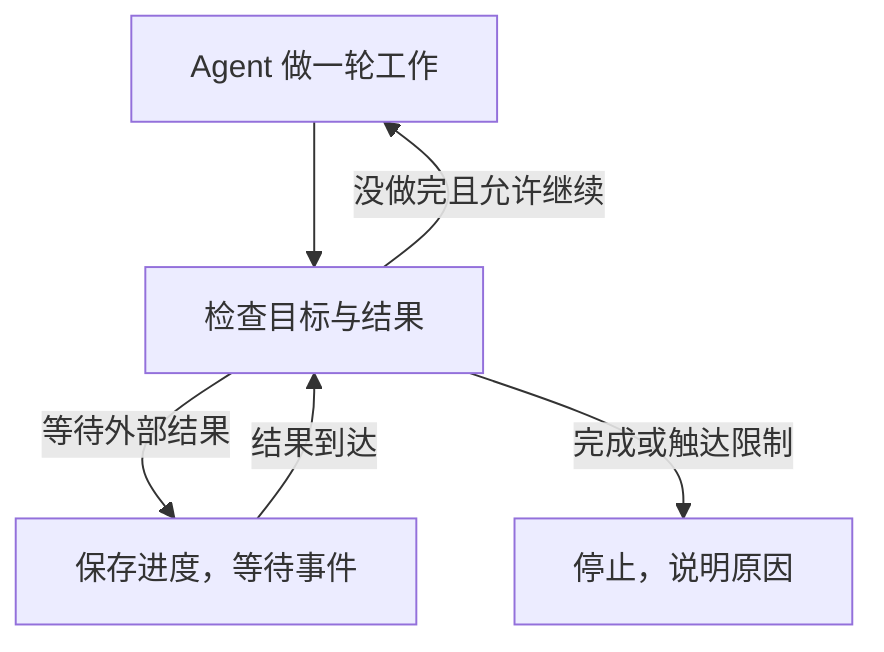

**目标模式多管一件事。Agent 停下来以后，程序再决定它该结束、继续，还是等待。**

- 普通任务也能连续调用工具。目标模式主要减少了人手动催“继续”的次数。
- 自动续跑不保证做对。是否完成，还要看测试、文件或线上结果。
- 自己实现时，先做完成检查、自动续跑和次数上限；有跨进程需求再补恢复机制。

批量改代码、迁移接口这类容易漏项的工作比较适合。一次问答就能解决的事，通常用普通任务即可。

## 用一个漏改页面的例子看区别

假设任务是把首页和关于页的页脚年份都改成 2026，正文不能动。Agent 改了首页，就回复“已经完成”。

普通任务可能就此结束，需要人发现遗漏，再要求它继续。带有完成检查的目标模式会去读两个页面，发现关于页还是旧年份，把这个失败项送回 Agent，让它再做一轮。

| 执行到哪里 | Agent 的说法 | 程序检查到的结果 | 下一步 |
| --- | --- | --- | --- |
| 第一轮结束 | 已完成 | 关于页没改 | 继续修改 |
| 第二轮结束 | 已完成 | 两页都正确，正文没变 | 结束任务 |

程序没有因此获得更聪明的模型。它多了一次检查，以及根据检查结果继续执行的机会。如果第一轮就做对，两种模式的体感可以几乎一样。

这个例子也是下文可运行演示的全部任务。先把它理解清楚，再看大型项目里的预算和并发，会容易很多。

## 这层判断加在哪里

Harness 就是运行 Agent 的那层程序，负责调用模型、执行工具和管理任务。目标模式通常在这里实现。

普通 Agent 内部已经有循环。模型要求读文件，程序把结果交回去；模型要求修改代码，程序执行后再交回去。这样的过程可以重复很多次，直到 Agent 结束本轮。文中的“一轮”指这整段工作，不是一次模型请求。

目标模式在本轮结束后再作判断。



所以，“一直做，直到完成”这句提示可以影响 Agent 的行为；程序里的目标控制则负责在它已经停下之后，是否真的再启动一轮。普通 Agent 也可以有长时间执行、计划和上下文压缩，这些都不专属于目标模式。[OpenCode 的普通执行循环](https://opencode.ai/docs/agents/#max-steps)

## 自己实现，先写清做完的标准

对于页脚任务，最小实现只需要下面这份约定和一段控制逻辑。

```text
要做什么    首页、关于页的年份都改成 2026
怎样检查    读取两页，检查年份，并确认正文未变
做到哪停    检查通过就结束；最多允许执行 4 轮
不能做什么  不修改其他页面，不发布到生产环境
```

一轮结束后，先检查实际文件。检查通过就记录成功；没通过且还有额度，就把具体失败项交给下一轮。达到上限仍未完成，就明确记录“未完成，已达到限制”。不能把没额度了写成成功。

这里的检查器是程序中预先定义的规则。不要让 Agent 为了通过验收，自己改掉检查标准。对主观内容，可以增加独立模型或人工审阅；能由测试直接判断的内容，优先运行测试。

等到任务需要等待部署、审批或外部接口时，再增加“等待”状态。等待期间保存外部任务 ID，结果到了再处理，没必要不断调用模型重复说“还在等”。用户主动暂停，则要等用户明确恢复。

## Codex、Claude Code 和 Ralph 的做法并不一样

有的实现主要负责续跑，有的另外安排模型检查。不能看到 Goal 这个名字，就认为它们提供相同的完成保证。

| 实现 | 怎样决定继续或结束 | 使用时要知道的限制 |
| --- | --- | --- |
| Codex `rust-v0.135.0` | 保存目标状态，空闲时继续启动普通任务；主 Agent 自查并报告完成 | 这条完成路径没有另外启动独立验收模型 |
| Claude Code `/goal` | 另一个小型模型根据条件和对话记录判断 | 评估器不能自己读文件或运行测试，只能看对话中已有的证据 |
| Ralph Loop | 在准备退出时检查迭代上限和完成标记，否则再送回原始任务 | 输出了完成标记，不等于外部结果已经正确 |

Claude Code 还有两个细节。后台任务未完成时会暂缓评估；连续几轮没有工具进展时，也可能交还控制权，同时保留目标。目标仍然存在，不一定表示程序此刻还在调用模型。[Claude Code 的评估机制](https://code.claude.com/docs/en/goal#how-evaluation-works)

Ralph 使用的 Stop hook，可以理解为退出前执行的一段检查程序。它根据状态文件决定是否阻止本次退出。[Ralph 的实现](https://github.com/anthropics/claude-plugins-official/blob/85cce0381e7860082641b59d961a2b8c368b8b79/plugins/ralph-loop/hooks/stop-hook.sh)

<details>
<summary>对照 Codex 源码，续跑最终仍然调用普通任务</summary>

这里固定到 `rust-v0.135.0`，提交为 `4daceea869704f9f35e0a3949fc34711ef978a4e`，不把它泛化成所有桌面版本的行为。

一轮结束后，运行时可以进入 `MaybeContinueIfIdle`。随后 `maybe_start_goal_continuation_turn()` 检查是否空闲、有没有排队输入、目标是否仍为活动状态，通过后注入目标信息并启动下一轮。[轮次结束处理](https://github.com/openai/codex/blob/4daceea869704f9f35e0a3949fc34711ef978a4e/codex-rs/core/src/tasks/mod.rs)、[目标运行时](https://github.com/openai/codex/blob/4daceea869704f9f35e0a3949fc34711ef978a4e/codex-rs/core/src/goals.rs)

最终调用的是普通任务。

```rust
self.start_task(turn_context, Vec::new(), RegularTask::new())
    .await;
```

续跑模板要求主 Agent 自查，`update_goal` 处理器接收它报告的完成或阻塞状态。这个处理器没有自行运行项目测试。[续跑提示](https://github.com/openai/codex/blob/4daceea869704f9f35e0a3949fc34711ef978a4e/codex-rs/core/templates/goals/continuation.md)、[状态更新处理器](https://github.com/openai/codex/blob/4daceea869704f9f35e0a3949fc34711ef978a4e/codex-rs/core/src/tools/handlers/goal/update_goal.rs)

</details>

## 跑一遍，就能看到提前结束怎样被拦住

[演示脚本](/examples/harness-goal-loop.mjs)需要 Node.js 24 或更新版本，不调用付费模型，也不访问真实网站。它故意让模拟 Agent 每轮只改一页，却每次都宣布完成。

```bash
curl -fsSLo harness-goal-loop.mjs https://blog.mlxb.cc/examples/harness-goal-loop.mjs
goal_demo_dir=$(mktemp -d)
node harness-goal-loop.mjs init "$goal_demo_dir/goal.sqlite"
node harness-goal-loop.mjs tick "$goal_demo_dir/goal.sqlite" event-1
```

最后一条命令只执行一轮。返回结果中，Agent 的 `claimedComplete` 是 `true`，检查结果 `evidence.passed` 却是 `false`，失败原因是关于页没有修改。

让程序自动继续。

```bash
node harness-goal-loop.mjs run "$goal_demo_dir/goal.sqlite"
node harness-goal-loop.mjs status "$goal_demo_dir/goal.sqlite"
```

第二轮修改关于页，检查通过，状态变成 `SUCCEEDED`。再执行 `run` 不会重新开始。

这证明控制程序能拒绝一个过早的完成声明。由于模拟 Agent 的行为固定，实验不能证明真实模型两轮就能完成任务，也没有验证多台机器并发执行的安全性。

<details>
<summary>继续验证重复事件、暂停和执行上限</summary>

在新的演示数据库中执行。重复发送 `event-1` 不会多算一轮；暂停后，`run` 不会继续工作。

```bash
node harness-goal-loop.mjs init "$goal_demo_dir/pause.sqlite"
node harness-goal-loop.mjs tick "$goal_demo_dir/pause.sqlite" event-1
node harness-goal-loop.mjs tick "$goal_demo_dir/pause.sqlite" event-1
node harness-goal-loop.mjs pause "$goal_demo_dir/pause.sqlite"
node harness-goal-loop.mjs run "$goal_demo_dir/pause.sqlite"
node harness-goal-loop.mjs resume "$goal_demo_dir/pause.sqlite"
node harness-goal-loop.mjs run "$goal_demo_dir/pause.sqlite"
```

只允许一轮时，关于页来不及修好，状态会停在 `BUDGET_LIMITED`。

```bash
node harness-goal-loop.mjs init "$goal_demo_dir/limited.sqlite" 1
node harness-goal-loop.mjs run "$goal_demo_dir/limited.sqlite"
```

这里限制的是轮数，没有计算真实模型费用。SQLite 保存了页面数据、状态和事件回执，所以这些独立进程能接着同一个目标工作。

</details>

## 放进实际项目，最容易漏掉什么

前面的控制逻辑可以作为起点。下面这些问题出现时，再补对应机制，不必把所有设施一次搭齐。

### 检查过的文件，后来又被改了

测试通过，只能说明被测试的那份内容符合当时的规则。如果用户改了目标，或者 Agent 又改了文件，旧结果就不能继续用来宣布完成。

因此，验收记录至少关联目标版本、被检查文件的版本和检查结果。代码任务可以用提交 SHA 标识内容；一般文件可以记录内容哈希，用来判断文件是否变化。最终写入成功状态前，再核对一次。

验收规则也要覆盖禁止变更的内容。比如不能为了让测试变绿而删除测试，不能把“代码已推送”当成“线上已更新”。发布任务需要继续核对部署版本和线上结果。

### 两个执行进程，正在修改同一个任务

执行进程通常叫 Worker。只有一个 Worker 时问题较少，多台机器接手任务后，就要明确谁当前有权执行。

常见做法是发放有期限的执行权，也就是租约。旧 Worker 卡住后租约过期，新 Worker 可以接管；如果旧 Worker 又恢复，提交结果时就需要用接管序号拒绝它的过期写入，这个序号叫 `fencing_token`。

只检查数据库还不够。旧 Worker 如果能继续改共享文件，仍会影响结果。代码任务可以在各自独立的工作目录执行，验收后再接纳指定版本。更完整的领取、消息去重和恢复实现放在[长任务运行机制](/ai/durable-agent-task-runtime/)中。

<details>
<summary>接入模型后，数据库事务怎样划分</summary>

不要锁着数据库等待几分钟的模型响应。用短事务领取任务，在事务外执行，再用短事务接纳结果。

```text
领取任务    检查状态与版本，取得租约，预留预算
执行工作    调用模型和工具，生成候选文件，运行检查
接纳结果    结算用量，核对版本与执行权，再更新目标状态
```

过期结果不能推进目标，但已经产生的费用仍要入账。费用处理可以独立提交，避免拒绝旧结果时连账目一起回滚。

需要发队列消息时，可以把待发送事件与目标状态放进同一事务，再异步发送。这种待发送事件表叫 Outbox，能处理“状态保存了，消息还没发就重启”的情况。发送仍可能重复，所以接收端还要按事件 ID 去重。

</details>

### 程序一直在跑，却没有进展

多跑几轮不一定有用。如果文件没变、同一组检查一直失败、工具返回同一种错误，就应该换方案或请求人工介入。不要拿消息数量当作进度。

下一轮至少要拿到当前目标、失败项、已经尝试过的办法和剩余额度。长日志放外部存储，按需读取；摘要可以缩短输入，但不能把未解决的问题一起省掉。

轮数上限也不等于费用上限。一轮可能启动多个子 Agent，还会产生评估和重试费用。并发执行时，应在请求前共同预留预算，结束后按实际用量结算。否则两个 Worker 都看到余额够用，却一起把额度花超了。

暂停或取消后，程序应停止调度新一轮。已经取消的任务，即使收到迟到结果，也不能重新变成成功。

取消请求也未必能撤销已经发生的计费或工具动作。无法确认用量的请求保留待对账记录，不按零费用处理。

### 需要新的权限，或者外部动作结果不明

“做到完成”为止，不会自动授予生产发布、扣款或设备控制权限。缺少授权时应等待人确认。

工具超时也不能一律重试。比如“把亮度设成 30%”和“再降低 10%”，重复执行的后果不同。结果未知时先查询外部状态；接口支持重复请求只执行一次时，复用同一个幂等键，也就是同一业务操作的去重标识。

保存目标，只解决目标记录还在的问题。服务退出后，仍需有执行进程重新接手。具体如何保存进度，可以看[服务重启后的 Agent 恢复](/ai/agent-context-persistence-recovery/)。

## 怎样判断它值不值得加

用同一批任务和相同总预算，比较普通任务、自动续跑、自动续跑加独立检查三组。普通任务也要给出清楚的要求并允许自检，不能故意把它限制成一次模型请求。

优先看三件事。

- **实际完成率**，按统一的外部检查标准，有多少任务真的做完。
- 错误报喜的次数，有多少任务说完成了，却没有通过检查。
- 每个成功任务的总费用，把失败尝试、重试和评估费用也算进去。

测试任务里要安排一次“只改一半就结束”。如果程序发现遗漏、给出具体失败项并继续完成，目标控制才在这件事上提供了可观察的帮助。
