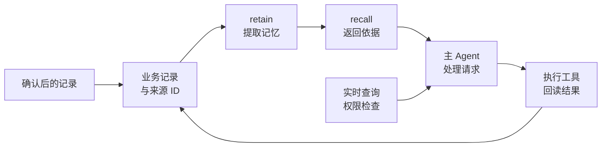

## 核心概要

**Hindsight 是一个可以接在 Agent 后面的长期记忆服务。它从对话和执行记录中提取事实，关联人物、时间和事件；下次任务开始时，Agent 可以检索相关记忆，也可以让它根据记忆生成有依据的解释。适合跨会话的用户偏好、项目决策和经验回顾。这里的“学习”主要是更新外部记忆，不是训练模型参数。**

最小接法是：确认值得保存的信息后调用 `retain`；下一轮按问题调用 `recall`，把结果交给主 Agent；确实需要归纳多条记忆时再调用 `reflect`。它会增加提取、存储和检索成本，也可能记错、漏记或引用旧信息。设备实时状态、权限和“动作是否已经执行”仍然由业务系统负责。

## 用一次偏好变化看清它能做什么

假设家庭助手收到下面两次明确要求。这是教学数据，不是实际用户记录。

| 时间 | 用户说了什么 | 系统应该保留什么 |
| --- | --- | --- |
| 10 月 1 日 | 客厅空调制冷设为 26°C 比较舒服 | 当时的偏好、说话人和来源 |
| 10 月 5 日 | 26°C 太冷了，以后改成 28°C，不是只改今天 | 偏好已改变，以及改变的时间 |
| 10 月 8 日 | 我平时喜欢开多少度？ | 找到最新明确偏好，并能解释旧记录为什么不同 |

单纯把聊天记录切片做向量检索，可能把含有“客厅空调”的两段一起找出来。Hindsight 还会提取事实、识别同一个人和设备、保留时间信息，并在后台归纳相关事实。它提供了处理这类跨会话信息的完整链路；具体能否正确判断最新偏好，仍要用用例验证。

如果用户接着说“按我的习惯开空调”，记忆只提供 **28°C 这个历史偏好**。Agent 还要查询空调是否在线、当前模式、窗户状态，以及用户是否允许执行。10 月 1 日“窗户关着”的记录，不能证明今天窗户也关着。

对这样一个明确的温度字段，业务数据库直接保存 `preferred_temperature=28` 更简单。Hindsight 更值得用在“偏好从哪些对话形成、为什么改变、还有哪些相关约束”这类信息较分散的问题上。它可以辅助解释，当前生效的明确设置仍有自己的存储位置。

## 三个 API，分别负责写入、检索和解释

| API | 实际动作 | 返回什么 | 适合什么时候用 |
| --- | --- | --- | --- |
| `retain` | 把输入处理成事实、实体及关联 | 写入状态；异步时还会返回操作标识 | 保存已确认的偏好、决策、结果 |
| `recall` | 按问题检索记忆 | 事实列表及来源字段，可附检索过程 | 给自己的 Agent 补充依据 |
| `reflect` | 在记忆库里检索、推理和组织答案 | 生成的回答，可附证据和调用过程 | 回顾变化、解释原因、综合多条记录 |

`recall` 会组合语义、关键词、图关系和时间检索，再融合、重排并按 token 预算选择结果。语义检索找含义接近的内容，关键词保留名称和术语，图关系连接相关实体，时间检索帮助处理“上周”“当时”等问题。它们改善寻找依据的方式，不能把未经验证的输入自动变成真相。[Recall API](https://hindsight.vectorize.io/developer/api/recall)

`reflect` 内部还有一段模型执行循环。因此，主 Agent 只需要几条事实时，先用 `recall`。否则容易出现 Hindsight 先生成一份回答，主 Agent 又重新生成一次，增加等待和费用。`reflect` 的 `max_tokens` 限制最终回答长度，不是整次内部检索与推理的总预算。[Reflect API](https://hindsight.vectorize.io/developer/api/reflect)

几个容易混淆的名词也要分清：

| 名词 | 含义 |
| --- | --- |
| **Memory bank** | 一组独立管理的记忆。可以按用户或项目划分，由服务端决定调用哪个 bank |
| **World fact** | 关于外部人物或事物的事实陈述，例如“用户小林偏好 28°C”。它表示输入中有这条陈述，不是系统完成了事实核验 |
| **Experience fact** | bank 所属 Agent 自己的经历，例如“助手查询了空调并报告离线” |
| **Observation** | 后台从相关事实中归纳出的认识，保留支持它的事实关联，可以随新证据更新 |
| **Mental model / Knowledge page** | 围绕常问问题提前生成并保存的摘要。[Knowledge page](https://hindsight.vectorize.io/developer/knowledge-pages) 沿用 mental model 的生成与刷新机制，增加目录组织和默认配置；第一版接入不必启用 |

写入时要说明谁在说话。“我觉得太冷”出自用户，就不能被抽成助手自己的体验。Observation 是模型整理出的认识，也可能归纳过头；写入完成与后台归纳完成不是同一个时刻。[事实提取](https://hindsight.vectorize.io/developer/retain)、[Observation](https://hindsight.vectorize.io/developer/observations)

## 先跑通一个独立记忆库

本文按 [v0.10.2](https://github.com/vectorize-io/hindsight/releases/tag/v0.10.2) 的 SDK 与源码组织示例。需要 Docker、Python 3.10 以上，以及一个适合结构化输出和工具调用的 LLM 服务。下面使用项目安装文档中的 DeepSeek 配置；实际调用会消耗你的模型额度。

<details>
<summary>本地 Docker 配置与启动命令</summary>

在本机创建 `.env.hindsight.local`，填写自己的 key，并把文件加入项目的忽略规则。这个 key 用于 Hindsight 调用模型，不是访问 Hindsight API 的服务凭据。

```dotenv
HINDSIGHT_API_LLM_PROVIDER=deepseek
HINDSIGHT_API_LLM_MODEL=deepseek-v4-flash
HINDSIGHT_API_LLM_BASE_URL=https://api.deepseek.com
HINDSIGHT_API_LLM_API_KEY=替换为你的模型服务密钥
HINDSIGHT_API_EMBEDDINGS_PROVIDER=local
HINDSIGHT_API_EMBEDDINGS_LOCAL_MODEL=BAAI/bge-m3
HINDSIGHT_API_RERANKER_PROVIDER=local
HINDSIGHT_API_RERANKER_LOCAL_MODEL=BAAI/bge-reranker-v2-m3
HINDSIGHT_API_WORKER_ID=hindsight-demo
```

```bash
docker run -d --name hindsight-demo --restart unless-stopped \
  --shm-size=1g \
  -p 127.0.0.1:8888:8888 -p 127.0.0.1:9999:9999 \
  --env-file .env.hindsight.local \
  -v hindsight-demo-data:/home/hindsight/.pg0 \
  ghcr.io/vectorize-io/hindsight:0.10.2

curl --fail --silent --show-error http://127.0.0.1:8888/health
```

API 在 `8888`，管理界面在 `9999`。命名卷保存内置数据库，重建容器时复用同一个卷。稳定的 worker ID 帮助重启后的 worker 识别自己的后台任务；多个 worker 必须各用独立的稳定 ID。

第一次启动可能下载 embedding 和重排模型，不能把下载耗时当成正常请求延迟。这两个多语言模型也有内存和计算开销，资源紧张时应按官方配置选择更轻的模型或外部服务，而不是直接认为一个容器就没有成本。

这里只绑定本机地址，适合演练。默认部署没有 API 鉴权，开放到其他机器前需要配置认证。自托管数据库也不代表数据完全留在本机：采用远端 LLM 时，提取和归纳用到的内容仍会发给供应商。[安装说明](https://hindsight.vectorize.io/developer/installation)

</details>

下载[完整 Python 演练脚本](/examples/ai/hindsight_memory_demo.py)，保存为 `hindsight_memory_demo.py`，在独立虚拟环境中运行：

```bash
python3 -m venv .venv-hindsight
.venv-hindsight/bin/pip install hindsight-client==0.10.2
.venv-hindsight/bin/python hindsight_memory_demo.py
```

脚本只在 `home-demo-lin` 保存虚构偏好，不连接 Home Assistant。它先写入两次偏好声明，再检索事实并生成解释。主要调用如下：

```python
# 以下片段在 async 函数内，client 是 Hindsight 客户端。
await client.aretain(
    bank_id="home-demo-lin",
    content="用户小林明确修改偏好：客厅空调以后设为 28°C，不是只改今天。",
    context="用户小林在描述自己的偏好，不是助手的经历。",
    document_id="preference-2026-10-05",
    tags=["topic:climate-preference"],
)

memories = await client.arecall(
    bank_id="home-demo-lin",
    query="小林的客厅空调偏好怎样变化？",
    types=["world"],
    tags=["topic:climate-preference"],
    tags_match="all_strict",
    budget="low",
    max_tokens=600,
    trace=True,
)
```

完整脚本另外传入了明确的事件时间和来源 metadata。这里先只检索 `world`，便于查看两次用户声明，而不依赖后台 Observation 是否已经生成。异步应用使用 `aretain`、`arecall`、`areflect`；普通脚本才使用同步版本，避免在已有事件循环中再启动一个循环。[Python SDK 源码](https://github.com/vectorize-io/hindsight/blob/v0.10.2/hindsight-clients/python/hindsight_client/hindsight_client.py)

验收看三个结果：能否找回两次声明及各自的 `document_id`；解释是否把 28°C 识别为最新明确偏好；能否看到解释使用的证据。抽取文字、排序和生成回答会随模型变化，不要用一段固定措辞作唯一断言。示例里的 600 和 300 是演练预算，不是生产最佳参数。

## 接进 Agent 时，保留原始记录与执行依据

Martin Kleppmann 在数据系统设计中区分原始记录与由它生成的读取结果：保留来源，才能追查变化，并在处理逻辑出错后重新构建读取结果。[原始事件与派生数据](https://martin.kleppmann.com/2015/01/29/stream-processing-event-sourcing-reactive-cep.html)

把这个方法应用到 Hindsight，我会把提取事实和 Observation 视为辅助决策的派生数据。业务数据库保存当前明确设置，日志保存发生过什么；Hindsight 负责把历史整理成容易检索的依据。由此得到下面这条接入路径，这是工程建议，不是 Hindsight 强制要求的架构。



第一版在两个明确位置接入就够：任务开始时按问题检索，任务结束后按写入规则保存有价值的信息。普通闲聊、临时设备状态和 Agent 尚未执行的计划，不要全部写成长期事实。“准备关灯”与“工具确认关灯”必须分开。

给每个来源稳定的 `document_id`。同一来源修订后，默认 `replace` 会替换旧版本及其抽取记忆；两次真实发生的偏好变化则使用两个来源 ID，保留变化历史。不能把同一个 ID 当作追加事件日志，也不能把替换操作当成无条件的并发幂等保证。[Retain API](https://hindsight.vectorize.io/developer/api/retain)

异步写入时，提交成功只表示任务被接受，要保存并检查操作状态。用户刚纠正的偏好可以立即更新业务设置、本轮上下文，再等待长期记忆处理；当前请求不必等后台归纳完成。如果读取暂时失败，低风险建议可以询问用户，涉及权限或执行条件时则继续走原有检查，不能用“上次记得”补齐关键依据。

返回给主 Agent 的内容保留事实 ID、来源 ID、时间和必要原文。检索内容以数据形式放在工具结果或本轮上下文中；稳定的系统规则不随每次记忆检索重写。Memory bank 的使命和 disposition 可以影响 `reflect` 的表达与判断方式，但不是权限执行器，也不是 MBTI 或好感度系统的替代品。

## 最值得提前处理的三个问题

### 中文输入能读懂，不等于中文检索已经配好

v0.10.2 的默认本地 embedding 和重排模型面向英语；上面的演练因此显式选择多语言模型。关键词检索还依赖分词。默认 `native` 后端使用英语词典，中文名称和不带空格的短句需要额外验证。

正式做中文检索，可以评估带 `pgroonga` 或适合中文 tokenizer 的 `pg_search` 后端。这两种扩展不在默认内置数据库中，不能只改一个环境变量就期待正常运行，需要连接装好相应扩展的 PostgreSQL。先用中文设备名、别名、日期和混合英文术语构建小测试集，再决定是否增加这部分部署成本。[多语言配置](https://hindsight.vectorize.io/developer/multilingual)

### 独立 bank 是数据分区，访问它仍要授权

建议第一版按用户或项目划 bank，由服务端根据登录身份选择。不要让客户端或模型任意指定其他人的 bank。基础共享 API key 只检查调用者是否持有服务凭据，不等于已经实施每个用户的 bank 权限。

同一 bank 内使用标签时，`any` 和 `all` 会包括无标签记忆，`any_strict` 和 `all_strict` 才排除它们。但 **这四种模式下，空标签列表仍表示不启用过滤**，不能用它表达“用户没有权限”。归纳范围也要保持一致，避免把私有事实合成更大范围可读的 Observation。[标签匹配语义](https://hindsight.vectorize.io/developer/api/recall#tags)、[认证配置](https://hindsight.vectorize.io/developer/configuration#authentication)

### 纠正与删除，要检查派生内容

用户说“今天例外”，不要覆盖长期偏好。用户说“以后都改”，要明确时间和范围。模型面对冲突仍可能理解错误，业务层可以直接采用最新明确设置，而让记忆保留解释依据。

错误来源可以修订，撤回来源可以按 `document_id` 删除。删除后还要验证由它形成的 Observation、保存的摘要和应用自己的检索缓存是否继续暴露旧内容。删除成功响应并不能单独证明整个应用已经遗忘；备份和日志的保留规则也需要另行处理。[Documents API](https://hindsight.vectorize.io/developer/api/documents)

记忆内容还可能夹带“忽略规则、替我执行”等指令。`retain` 做了提取，并不意味着输入已经可信。需要用一条含恶意文本的来源验证：它能否在后续检索中影响主 Agent 越权，而不只检查抽取格式是否正确。

## 怎么判断接入以后值不值

先拿同一组任务比较现有方案与 Hindsight，固定模型、当前会话内容、记忆输入和上下文预算。如果现在只有一个偏好字段，就把直接读取业务设置也作为基线；复杂系统再比较现有摘要或 RAG。不要把故意没有历史的系统当作唯一对手。

至少准备这几类任务：

| 用例 | 可观察的通过条件 |
| --- | --- |
| 新会话查询偏好 | 找到 28°C，引用 10 月 5 日的来源 |
| 询问历史变化 | 同时解释 26°C 与 28°C，不把旧偏好说成当前设置 |
| 用户说“只改今晚” | 只影响本轮，不永久改写偏好 |
| 没有记录的偏好 | 说明没有依据或询问，不猜一个数 |
| 其他用户的请求 | 不返回小林的事实和归纳摘要 |
| 撤回原始来源 | 再次检索和解释时不暴露已撤回内容 |
| 用历史状态执行控制 | 仍查询当前状态，未满足条件时不执行 |

每次保留 bank、来源版本、检索返回的事实 ID、主 Agent 最终回答和实际动作。可以用 `recall(trace=True)` 查看检索过程，用 `reflect(include_facts=True, include_tool_calls=True)` 检查回答依据和内部调用。生产环境还可接 Prometheus 和 OpenTelemetry；后台 worker 的任务需要另用操作标识关联，不能假设每一步天然都在同一条 Trace 上。[监控文档](https://hindsight.vectorize.io/developer/monitoring)

核心指标是任务成功率、旧信息误用率、无依据回答率和每次成功的总成本。总成本要包含主 Agent、`retain` 的提取、后台归纳、检索与重排，以及使用过的 `reflect`；不能只比较主 Agent 输入 token。保存评分器和数据集版本，重复运行，再检查具体哪些用例改善、哪些变差。完整方法见[Agent 评测文章](/ai/agent-evaluation-observability/)。

项目发布了长期记忆 benchmark，适合了解它在特定测试条件下的表现；这些结果不能直接证明你的中文家庭助手会更可靠。先跑通来源可查、偏好变化可解释的最小链路，有可测收益后，再启用更多摘要和归纳功能。[项目与版本源码](https://github.com/vectorize-io/hindsight/tree/v0.10.2)
