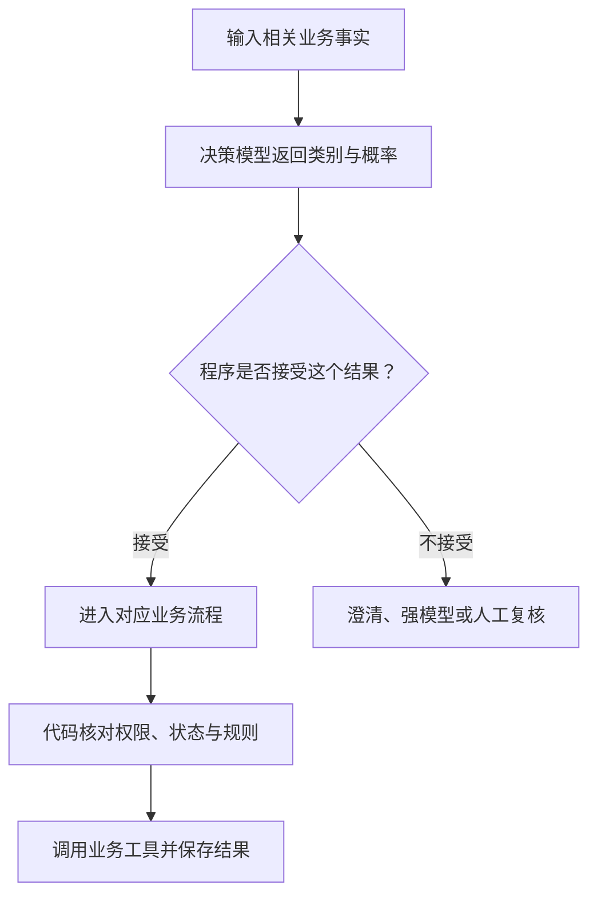

**Jev 是 TypeSafe AI 专门为分类、是非判断和评分训练的决策模型，输入业务状态和限定问题，直接返回结果及概率分布。**

它适合工单分流、请求路由、内容筛查和 Agent 结果评测这类高频判断。程序知道可能的答案，只需要模型理解当前材料并作出选择。接入时要给出明确标准、保留无法判断的出口，再用业务数据决定哪些结果可以自动接受；写回复、提取任意字段和精确计算仍有其他工具负责。

可以把 Jev 理解为“专门训练来做语言判断的模型”。TypeSafe 将它称为 **System One model**，并声明采用了新的模型架构、并行处理方式和 RLCD 训练。因此，“专门用于决策的 LLM”能帮助理解用途，却不足以说明它的实际实现；不能把它等同于普通 LLM 限制输出长度，也不能从开源模型的复刻方案反推 Jev 的内部结构。[官方发布说明](https://typesafe.ai/blog/introducing-system-one-models-and-jev)

## 一张工单，可以拆成三个问题

假设客服收到：“同一份订阅被扣了两次，请退掉重复的那笔。”这是教学场景，下面的概率也是假设值。

系统可以同时问三个独立问题：

| 问题 | Jev 类型 | 程序收到什么 |
| --- | --- | --- |
| 应交给账单、技术、账户还是其他团队？ | `choice` | 选中的类别，以及每个类别的概率 |
| 用户是否明确要求退款？ | `noul` | “是”的概率，例如 `0.97` |
| 这张工单有多紧急？ | `score` | 按预先定义的等级评分，以及各等级概率 |

`noul` 是 TypeSafe 对是非判断的命名。它返回的是“这个条件为真”的概率，不是回复质量评分。`score` 则需要有顺序的量表，例如“普通咨询、部分功能受阻、核心业务中断”；结果是等级索引的概率加权平均，可以落在两级之间。[问题类型与 API](https://docs.typesafe.ai/api)

模型判断“用户要求退款”，并不证明真的发生了重复扣款。程序还要查交易记录，确认订单、金额、支付状态和退款资格。把语言理解交给模型，把能查清和能算清的事实交给业务系统，才能知道每个结果的责任归属。

一次请求可以携带共享状态和多个问题，但问题应相互独立。先判断类别、再根据类别选择下一组规则的流程，仍需要程序分步组织，不能指望同一批问题自动形成推理链。

## 与“让模型只输出 A、B、C”有什么区别

两者可以完成同一道分类题。需要分清的是模型训练、推理方式和调用接口。

普通 LLM 生成一个字母之前，已经算出了下一个 **token** 的分数。token 是模型处理文字的单位；某个字母或带空格的字母能否对应一个 token，取决于 tokenizer。模型给各 token 的原始分数叫 **logit**；**softmax** 将一组分数转换成总和为 1 的概率。

开源模型的固定选项评分，就是给类别分配单 token 标签，读取答案位置上这些标签的分数，只在选中的标签之间归一化。SGLang 的 `/v1/score` 支持这条路径，客户端再把标签映射回业务类别。[SGLang 评分接口](https://docs.sglang.io/docs/basic_usage/native_api#v1/score-decoder-only-scoring)

| 做法 | 获取结果的方式 | 仍需验证什么 |
| --- | --- | --- |
| 普通 LLM 只输出一个标签 | 生成标签；需要分布时还要获取候选 token 的 logprobs，即对数概率 | 分类准确率、完整候选分数是否可取、标签与聊天模板是否匹配 |
| 普通 LLM 固定选项评分 | 读取标签分数，省去继续生成文本的步骤 | 原始分数是否校准、选项顺序偏差、答案位置是否落在推理文本中 |
| Jev 等专用决策模型 | 用决策接口获取类型化答案；Jev 还专门训练了决策概率 | 在实际领域、语言和错误成本下，是否值得接受这个判断 |

**如果普通调用已经只生成一个 token，并能返回全部候选标签的分数，评分方式的计算优势可能很小。**

评分最容易省掉的是生成 JSON、解释和其他不需要的文字，而读取输入的计算仍然存在。输入很长，模型仍要处理很长的上下文。

Jev 的额外价值不能只用“少输出几个字”解释。TypeSafe 将训练目标称为 **RLCD，Reinforcement Learning for Calibrated Decisions**：通过强化学习，让决策概率更符合实际结果。它与沿用普通 Qwen 权重、读取下一 token 分数，是两件不同的事。后者能复现固定答案评分的接口行为，不能据此声称复现了 Jev 的训练效果。[TypeSafe 对训练目标的说明](https://docs.typesafe.ai/introduction/machine-learning-primer)

## 概率、置信度和校准，分别是什么意思

假设两个结果都选择账单团队：

```text
结果一：账单 0.91，技术 0.04，账户 0.03，其他 0.02
结果二：账单 0.46，技术 0.44，账户 0.06，其他 0.04
```

第一组明显偏向账单，第二组几乎打平。只拿一个标签，程序看不到这个差别。

`probabilities` 保留完整分布。TypeSafe 的 `confidence` 则从分布中计算出一个汇总值，并不是另一项独立测出来的正确率。以上第一组四选一，按照官方 Choice 公式，`confidence` 是 `0.88`；最高选项概率是 `0.91`。不同供应商的字段定义可能不同，不能把同一个阈值直接搬过去。[Confidence 的定义与公式](https://docs.typesafe.ai/confidence)

**校准**关注的是大量预测：模型给出约 90% 概率的一组判断，实际是否约有 90% 成立。专门训练概率，是为了让程序更好地处理不确定性，仍不保证某次判断正确，也不保证换成中文、行业术语或另一套分类以后表现不变。

还有一个容易漏掉的条件：选项是否覆盖输入。只提供“账单、技术、账户”，遇到商务合作也会被迫在三者中选一个。补上 `other`、`unknown` 或需要澄清的选项，并为它安排实际去向，才能处理分类范围外的请求。

精确计算直接交给代码。金额加总、日期先后、权限与订单状态不需要概率判断。Jev 官方也列出了数字处理、复杂间接推理、无关长上下文、对抗性内容和选项顺序等已知限制；这些应进入评测集，而不是靠“专用模型更可靠”一句话略过。[Jev 1.13 已知限制](https://docs.typesafe.ai/model-jaggedness/jev-1.13)

## 哪些场景值得接入

最适合的任务，是输出范围有限、需要理解语言、执行频率高，而且结果可以检查的判断。

| 场景 | 适合交给决策模型的部分 | 后续仍由谁完成 |
| --- | --- | --- |
| 客服与表单分流 | 属于哪个团队，是否要求退款，是否需要升级处理 | 工单系统派单；业务系统核实交易并执行退款 |
| 模型与工具路由 | 普通问答、复杂任务、设备控制还是需要澄清 | 程序选择流程；生成模型准备回复或工具参数 |
| 内容筛查 | 评论属于正常讨论、广告还是其他类别 | 程序按规则处理，并保留复核入口 |
| RAG 与记忆 | 某段材料是否相关，某条候选事实是否值得保留 | 检索系统查找来源；记忆服务去重、写入和更新 |
| Agent 评测 | 回复是否受到证据支持，是否正确使用工具，是否完成指定目标 | 测试代码核对硬条件；人工审查判断标准与争议样本 |

对家庭助手，可以先把“把客厅灯调到 30%”识别为设备控制。这个类别还没有设备 ID、亮度参数和执行结果；后续仍要提取参数，再交给已有 Skill 和 HA 脚本。需要更新关系状态时，也只让模型判断是否出现某类事件，去重、限频和好感度结算留在服务端。

语义判断本身的质量必须单独检查。LangChain 的 Jev 评测复用了 **5 条固定的天气 Agent 结果，每条重复 100 次**，观察到较好的重复一致性和较低成本。这是探索性结果，500 次判断不等于 500 个不同场景；原文还披露了生成模型使用默认采样参数、未记录 Jev 服务版本等条件。因此，它支持“值得测试为评测器”，不能证明所有业务上都更准确。[LangChain 原始评测](https://www.langchain.com/blog/jev-agent-evals-langsmith)

## 国内外有哪些托管 API 可以调用

以下按 **2026-10-10 的官方文档**整理。原厂模型、转接网关和通用模型的决策 API 分别说明；有调用入口，不等于已经具备你的生产 SLA、容量或数据处理条件。

| 服务入口 | 模型、调用方式与当前限制 |
| --- | --- |
| **阿里云百炼** | `decision-model-preview`，通过 System One 接口调用。官方列出北京、新加坡地域；仍是 Preview，先验证账户可用性和配额。[API](https://help.aliyun.com/zh/model-studio/decision-model-api) |
| **TypeSafe 原厂** | `jev-1.13.0` / `jev-latest`，通过 `/v1/systemone` 调用。Jev 1.13.0 只接收文本，英文是主要训练语言，中文需要单独评测。[模型信息](https://docs.typesafe.ai/models) |
| **Vercel AI Gateway** | `typesafe-ai/jev`，转接的仍是 TypeSafe Jev。可沿用 Gateway 的接入方式；SDK 与 HTTP 路径要按当前文档选择。[模型页](https://vercel.com/ai-gateway/models/jev) |
| **Cloudflare Workers AI** | `@cf/cloudflare/clef`、`@cf/cloudflare/clef-flash`，通过 Workers AI 调用。这是 Jev 之外的模型选择，支持类型化决策和图片输入。[Clef](https://developers.cloudflare.com/workers-ai/models/clef/)、[Clef-flash](https://developers.cloudflare.com/workers-ai/models/clef-flash/) |
| **OpenAI Decisions API** | `gpt-6-luna`，通过 `/v1/decisions` 调用。当前为 Public Beta，支持文本和图片；请求格式与 System One 不同。[官方说明](https://developers.openai.com/api/docs/guides/decisions) |

### 国内后端：先核对百炼的专用入口

百炼的 `decision-model-preview` 通过 System One 协议接收 `state` 和 `questions`，返回分类、是非判断、评分及概率。它不是给 `chat/completions` 换一个模型名就能调用的聊天模型。

截至核对日期，模型信息页列出了 65,536 token 上下文、北京和新加坡地域、限流及限时免费状态，同时标注不支持 Function Calling、上下文缓存和模型调优。限时免费不能作为长期成本依据，Preview 也不自动承诺生产稳定性；上线前核对价格、模型变更、容量和服务条款。[百炼模型信息](https://www.alibabacloud.com/help/zh/model-studio/decision-model-preview)

还要分清 **百炼模型服务**与 **Token Plan 套餐**。Agent Studio 确实给出了 Token Plan 接入决策模型的工具示例，但套餐使用范围有自己的限制。生产应用后端应使用适合该用途的模型服务凭据和工作空间入口，不能直接把编程工具套餐的 Key 搬过来。[Token Plan 使用范围](https://docs.agent.bailian.aliyun.com/zh/token-plan/token-plan-team-overview#订阅前须知)、[工具接入示例](https://docs.agent.bailian.aliyun.com/zh/token-plan/token-plan-decision-model)

### 海外服务：按现有平台与输入需求选

已经使用 Vercel Gateway 时，可以先评测它提供的 Jev；需要直接控制 Jev 版本时，核对原厂版本化模型 ID。对固定版本调过阈值以后，使用 `jev-latest` 会让底层模型随更新变化，因此要记录真实返回版本，并在升级时重测。[版本与别名](https://docs.typesafe.ai/models)

在 Cloudflare 上运行的应用，可以评测 Workers AI 的 Clef 系列；需要根据照片作判断时，它与目前只接收文本的 Jev 有明确区别。具体图片格式、数量和请求大小，以调用端点为准，不把“多模态模型”理解为所有媒体都能直接上传。

已经使用 OpenAI 的应用，也有专用 Decisions API 可测试，但它仍处于公开测试阶段。`predicate` 是是非判断，返回 `probability`；请求使用 `input` 和问题数组，答案也是数组，还可能单独返回 `refusal`。因此，适配层要处理拒绝回答，不能把 TypeSafe 的 `answers` 对象解析代码直接复用。[OpenAI API 参考](https://developers.openai.com/api/reference/resources/decisions/methods/create)

只有文本分类需求、调用量较小时，先与当前的小模型分类方案比较。新增一个供应商还会增加网络、运维和故障处理成本；决策模型的单位价格低，不代表整个项目一定更便宜。

## 最小接入：先返回判断，再由代码处理

先把一项判断接成独立函数，例如 `classify_ticket(state)`，返回类别、分布和模型版本。供应商差异留在适配层，工单系统不需要理解 `noul` 与 `predicate` 的命名区别。

下面是按 TypeSafe API 编写的教学请求，未附带任何实测结果。先确认账户能够调用对应模型，再使用自己的 Key；这里的四个类别包含范围外请求的出口。

<details>
<summary>TypeSafe 请求示例，以及百炼的地址替换方式</summary>

```bash
curl --fail-with-body --silent --show-error \
  https://api.typesafe.ai/v1/systemone \
  -H "Authorization: Bearer $TYPESAFE_API_KEY" \
  -H 'Content-Type: application/json' \
  --data-binary '{
    "model": "jev-1.13.0",
    "state": {
      "customer_message": "同一份订阅被扣了两次，请退掉重复的那笔。"
    },
    "questions": {
      "team": {
        "type": "choice",
        "instructions": "按用户主要诉求选择处理团队。类别不覆盖请求时选择 other。",
        "criteria": {
          "billing": "扣费、发票、支付或退款问题",
          "technical": "产品故障、错误或集成问题",
          "account": "登录、密码或账户访问问题",
          "other": "其他诉求，或现有信息不足以确定团队"
        }
      },
      "refund_requested": {
        "type": "noul",
        "instructions": "用户是否明确要求退还款项？不判断是否符合退款资格。"
      }
    }
  }'
```

这里 `state` 放待判断的数据，`instructions` 写问题，`criteria` 写选项边界。返回结果按 `team`、`refund_requested` 这两个问题 ID 读取。原厂当前通过输入 token 计费；演练也是实际 API 调用。[TypeSafe API](https://docs.typesafe.ai/api)

改用百炼时，保持这组 `state` 与 `questions` 的语义，按其文档替换模型名、地址和鉴权：

```text
北京地址：
https://{WorkspaceId}.cn-beijing.maas.aliyuncs.com/compatible-mode/v1/systemone

新加坡地址：
https://{WorkspaceId}.ap-southeast-1.maas.aliyuncs.com/compatible-mode/v1/systemone

model：decision-model-preview
Authorization：Bearer <自己的 DASHSCOPE_API_KEY>
```

`WorkspaceId` 是业务空间 ID，要使用该工作空间和地域对应的 Key。切换后核对返回结构、字段定义和超时行为；协议相似不表示模型、置信度与容量承诺相同。[百炼 API](https://help.aliyun.com/zh/model-studio/decision-model-api)

</details>

程序收到 `billing` 后，可以派到账单队列；收到低把握结果或 `other`，则请求澄清或进入复核队列。退款资格仍由交易系统判定。



接受阈值来自评测，业务检查也不会因为模型分数高就被跳过。依赖项失败时要有具体去向：分类接口超时可以进入通用队列，不能默认选择一个团队；需要执行动作的流程，在缺少有效判断时保留未执行状态。

## 上线前，怎样判断是否值得换

先拿真实业务样本建立标注集，覆盖常见类别、模糊输入、范围外请求、否定句和对抗性内容。需要支持中文，就使用中文样本；英文演示结果不能代替它。调阈值和检查最终效果使用不同的数据，避免在同一批题上反复调到满意。

对照至少保留现有方案、只输出一个标签的小模型方案和候选决策 API。能用代码准确完成的任务，也保留代码基线。相同输入与判定标准下，重点看下面几项：

| 指标 | 它回答什么问题 |
| --- | --- |
| 分类准确率与各类别误判 | 总体能否分对，是否漏掉了某类请求 |
| 自动接受结果的正确率 | 程序准备直接使用的判断里，实际有多少正确 |
| 自动接受比例与回退比例 | 到底节省了多少工作，复核队列是否承受得住 |
| 概率校准 | 各概率区间是否对应相近的实际正确率 |
| 端到端 p50 / p95 延迟 | 普通请求和较慢请求分别要等多久，包含网络与回退 |
| 每次最终有效处理的成本 | 输入、重试、回退模型和人工处理合计花了多少 |

阈值提高通常会减少自动接受量，也可能增加复核成本。让所有请求都先经过一次分类，如果大部分随后仍调用原来的模型，总成本可能上升。只有判断足够可靠，并且确实省去了后面的工作，这一层才有明确收益。

上线可以先记录判断而不改变现有业务，再只接管容易验收的分流任务。保存输入摘要、判断标准版本、模型版本、完整概率、最终动作和业务结果；模型或规则更新后，就有依据重放样本并检查变化。

Jev 最值得尝试的位置，是程序已经有明确选项、又需要理解语言的那些判断节点。先选一个能独立评测的节点，让事实、标准、回退和结果都能检查，再决定是否扩展到更多流程。
