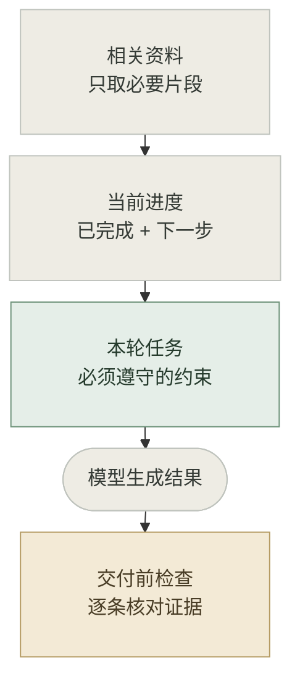

**模型可能读到了规则，却没有执行。减少遗漏，先少放无关资料，把本轮任务和关键约束放在一起，交付前逐条检查。** 这些方法能降低风险，不能保证零遗漏。

先确认规则确实发给了模型。被截断、被摘要删掉，或 Skill 没加载时，要把缺少的内容补回当前请求。

## 一张图，看懂本轮怎么组织

固定规则保留在平台规定的指令层。本轮任务的材料，可以先试下面的顺序：

<div class="context-note-visual">



</div>

## 七个做法，直接照着用

<div class="context-note-actions">

| 方法 | 直接怎么做 |
| --- | --- |
| **少放资料** | 文档只读相关段落，Skill 按需加载，日志只取报错附近。 |
| **末尾重申** | 长材料之后，简短列出本轮任务和关键约束。 |
| **分清主次** | 强约束保留原文，参考资料可摘要，过期要求清理掉。 |
| **先找证据** | 先定位原文、函数或运行结果，再作判断。 |
| **保存进度** | 阶段交接时，带上目标、约束、进度、待办和来源。 |
| **逐条复查** | 单独一轮提供约束与结果，逐条给出检查证据。 |
| **程序兜底** | 字段用 Schema 校验，接口兼容用回归测试，工具权限由执行层限制。 |

</div>

“优先级高”只是提示模型重点，不会改变平台权限。末尾重申的约束，也要与原有规则一致。

## 一份短模板

假设让编码 Agent 给订单查询增加分页：

```text
参考资料（可摘要）：订单接口文档的分页段落。
已确认：旧客户端仍在使用无分页参数的请求。
本轮任务：增加可选分页参数。

必须遵守（交接时原样保留）：
C1. 保留旧请求的返回字段和默认行为。
C2. 不修改数据库结构。

交付前逐条检查：
C1 → 给出旧请求的测试结果。
C2 → 给出数据库相关改动的 diff 检查结果。
未验证就写“未验证”；检查失败，修正后重查。
```

复查时提供的是**原始约束 + 实际结果**。只问“你检查过了吗”，模型的一句“检查过了”不能作为证据。

<details>
<summary>研究依据与适用边界</summary>

- **位置有影响，但不是唯一因素。** Lost in the Middle 在受测模型的问答与检索任务中发现，中间的信息更容易被忽略；Chroma 的实验也观察到输入变长、干扰内容改变时的性能下降。[Lost in the Middle](https://aclanthology.org/2024.tacl-1.9/)、[Context Rot](https://www.trychroma.com/research/context-rot)
- **末尾放任务，是可以测试的起点。** Anthropic 对 Claude 的长文档输入推荐“材料在前，问题在后”，并建议先提取相关原文。不能由此认定所有模型总是最关注末尾。[官方建议](https://platform.claude.com/docs/en/build-with-claude/prompt-engineering/claude-prompting-best-practices#long-context-prompting)
- **压缩后仍要检查约束。** 按需读取、外部笔记和历史压缩可以控制输入，但摘要可能遗漏信息。强约束保留原文，重要事实保留可回查的来源。[上下文工程](https://www.anthropic.com/engineering/effective-context-engineering-for-ai-agents)
- **自检不保证有效。** ICLR 2024 的研究发现，当时受测模型在缺少外部反馈的推理自纠错中可能变差。它不证明所有复查无效，但提醒我们提供可核对的证据。[自纠错研究](https://proceedings.iclr.cc/paper_files/paper/2024/hash/8b4add8b0aa8749d80a34ca5d941c355-Abstract-Conference.html)

</details>

验证效果：固定模型与任务，多跑几次，比较**约束遗漏率、任务通过率、Token 和耗时**。

相关笔记：[上下文工程](/ai/context-engineering-guide/)、[RAG 原理与实践](/ai/rag-primer/)。
