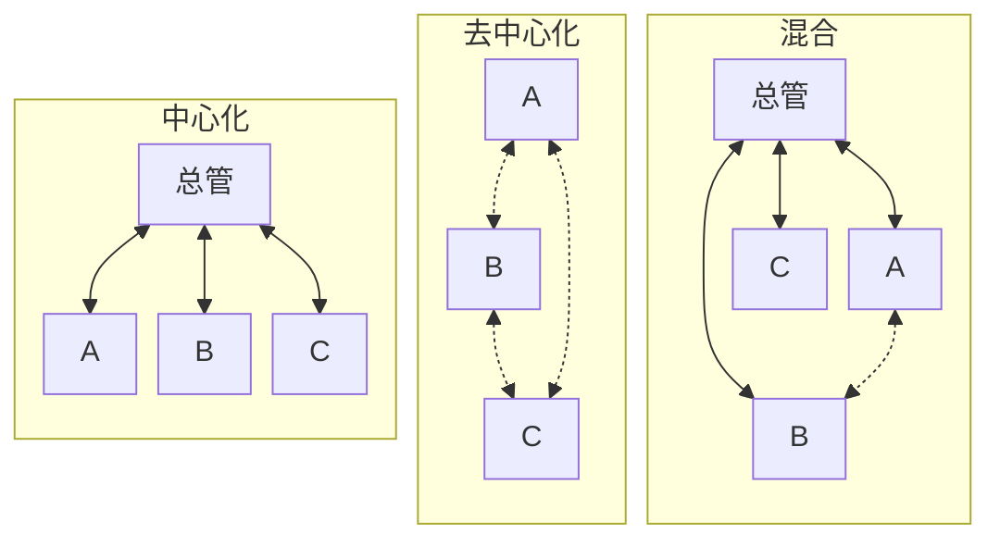

## 核心概要

**先保留单智能体（SAS）作为对照，不因为任务步骤多就拆成多个 Agent。要拆时，重点判断两件事：需不需要一个总管统一分工和收尾，以及执行者之间是否必须直接交换发现。**

独立并行（Independent）只在结束时汇总；中心化（Centralized）通过总管协调；去中心化（Decentralized）让同伴直接交流；混合（Hybrid）保留总管并开放局部交流。本文的迁移评估案例会先比较 SAS 和 Centralized：三路调查可以并行，但新发现需要统一改变其他任务的前提。没有比较结果前，不预设多 Agent 更好。

## 先看一个需要协作的任务

假设要评估：

> 一个业务系统是否应该从数据库 X 迁移到 Y？给出兼容性风险、性能依据、改造成本和建议。只做评估，不修改生产环境。

这是教学示例，不是某次真实迁移记录。为了对比，暂时把调查分成三块：A 查兼容性，B 测性能，C 算成本。字母表示执行者，不代表必须使用不同模型。性能测试只在隔离的测试环境进行。

这个案例有两项交付要求：调查结果要能回查证据；三部分结论必须采用一致的数据库版本和查询写法。不能拿旧写法的测试成绩，论证新写法迁移后也会快。

关键变化发生在调查中途：A 发现，Y 不支持业务正在使用的一种查询，必须改写；B 原来的性能测试因此不再有效；C 也要把改写和补测计入成本。

**五种架构的差别，就在于这条发现怎样传到 B、C，以及谁决定后续工作。** 下面沿用 Google Research 介绍的分类，再用这个场景说明具体做法。[架构分类来源](https://research.google/blog/towards-a-science-of-scaling-agent-systems-when-and-why-agent-systems-work/)

## 同一个任务，五种做法

### SAS：一个 Agent 连续完成

SAS 是 Single-Agent System，单智能体系统。一个 Agent 先查兼容性，发现查询需要改写，就调整测试，再重新估算成本。整个过程由它持续推进。

这不是“问模型一次就结束”。它可以调用很多次工具、根据结果修正判断。单智能体说的是只有一个负责推进任务的 Agent，不是只允许一次请求或一个工具。

这个例子里，前一步的发现直接决定后一步怎么做，保留完整过程很有用。若一个 Agent 已经能可靠完成调查，增加执行者就需要额外理由；“用了很多工具”或“运行时间长”本身都不够。

### Independent：分别完成，到最后再汇总

A、B、C 拿到各自的任务和初始资料，独立运行。A 不知道 B 的进展，B 也收不到 A 刚发现的不兼容问题。三份结果全部返回后，程序才进行汇总。

实现可以很简单：创建三个独立上下文，并发运行，等结果返回。没有持续派工的总管，也没有执行中的同伴讨论。这里用三个 Agent 只是示例，数量不是架构定义。

它适合互不影响的调查。如果 A 的发现会改变 B 的测试前提，独立执行就可能浪费工作，甚至把基于不同前提的结论放进同一份报告。

还要区分“并行”与“验证”。论文 v3 的 Independent 配置在末尾只拼接输出，不做交叉核验或多数投票；如果另加验证器，得到的是不同的实验配置，不能直接套用它的效果结论。[论文第 3.1 节](https://arxiv.org/html/2512.08296v3#S3.SS1)

### Centralized：由总管分工、追问和收尾

Centralized 是中心化架构。总管 Agent，也叫 orchestrator，向 A、B、C 分派任务，接收结果，再决定要不要补查。子 Agent 不直接找同伴，有需要就通过总管转达。

A 报告查询不兼容后，总管可以让 B 改测替代写法，同时让 C 增加改造成本。等新结果回来，总管再判断证据是否足够。**它与 Independent 的区别，是执行过程中也有人根据发现重新安排工作，不只是最后合并文本。**

落地时，把子 Agent 包装成可调用的任务，返回发现、证据和未解决问题。总管持有任务进度，而子 Agent 只接收完成自己那部分工作需要的资料。这也是常见的“主 Agent 调用子 Agent”方式。[子 Agent 模式](https://docs.langchain.com/oss/python/langchain/multi-agent/subagents)

它的问题也在中心：如果总管误解了 A 的报告，B、C 会一起收到错误要求；如果每个细节都要总管转述，总管的上下文和响应速度会成为限制。

### Decentralized：执行者直接交换发现

Decentralized 是去中心化架构，没有负责所有判断的总管 Agent。A 直接告诉 B：“这个查询不兼容，原测试不能说明迁移后的性能。”B 重新测试，再把新增索引的需求告诉 C。

论文测试的是同伴按轮次讨论、再投票形成结果的配置，不是无限制的自由群聊。落地时，程序负责把同伴的新发现送入各自上下文，让各方修正结果，并执行轮次上限和结果选取规则。投票没有解决的分歧应当保留，不能强迫模型编出一致结论。[论文架构说明](https://arxiv.org/html/2512.08296v3#S3.SS1)

这种方式适合调查方向会互相影响、同伴消息确实能改变下一步工作的情况。但消息多不等于信息多。反复复述同一个判断，只会增加费用；多数 Agent 同意，也不能代替可核验的证据。

### Hybrid：总管管整体，同伴解决局部问题

Hybrid 是混合架构。总管保留目标、分工和最终验收权，同时允许部分子 Agent 直接通信。

在迁移评估里，可以让 A、B 直接核对查询改写与性能测试，形成一致的测试前提后，再报告总管。总管决定是否让 C 重算成本，以及是否还需要其他调查。不是所有消息都要经过总管，也不是所有人都能随意改动总任务。

它适合“总体需要统一，但局部又离不开来回讨论”的任务。只有确实出现这种需要，额外的通信通道才有价值；否则只是在 Centralized 上增加了一套消息和状态管理。

下面只画需要持续协调的三种。实线表示总管与子 Agent 的双向消息，虚线表示同伴之间的双向消息；连线表示允许通信，不代表每条消息都会同时发送。

这张图描述的是**通信拓扑**，也就是谁能给谁发消息，不是服务器部署图。多个 Agent 可以运行在同一进程里。反过来，给一个 Agent 配置多个云端工具，也不等于建立了多智能体系统。

## 实验里的“最好”，要看和谁比

《Towards a Science of Scaling Agent Systems》比较了以上五种配置。这里采用论文 v3 的数据，SAS 是相同任务下的比较基线。

在 PlanCraft 中，Agent 要根据物品配方和当前库存安排制作步骤。一步操作会改变后续可用的材料，因此顺序很重要。论文报告的平均成功率如下：

| 架构 | PlanCraft 平均成功率 |
| --- | ---: |
| SAS | 56.8% |
| Independent | 17.0% |
| Centralized | 28.2% |
| Decentralized | 33.2% |
| Hybrid | 34.6% |

**Hybrid 只是四种多智能体里下降最少，仍不如 SAS。** 从 56.8% 到 34.6%，下降了 22.2 个百分点，相对降幅约 39%。不能把“退化最少”转述成“最适合顺序任务”。[论文第 4.2 节](https://arxiv.org/html/2512.08296v3#S4.SS2)

其他任务又呈现不同结果。在金融资料分析任务 Finance-Agent 中，Centralized 的平均表现从 SAS 的 34.9% 提高到 63.1%；在网页检索任务 BrowseComp-Plus 中，Decentralized 从 31.8% 提高到 34.7%。这支持按任务结构选型，不支持给五种架构排一个永久榜单。

“Independent 收益最低”也要限定实验范围。它缺少中途协作，未必适合这个迁移例子；但如果只是各自查清三份互不相关的资料，增加讨论不一定更好。模型、工具、预算和汇总方法变化以后，都需要重新评测。

## 把迁移评估走到一个选择

回到前面的交付要求：A 发现不兼容以后，B、C 都要更新工作前提，并保留可回查的依据。按这个要求筛选，而不是给五种架构各打一个总分。以下是案例的工程判断，不是论文的额外结论。

| 候选 | 在这个案例里怎样处理 |
| --- | --- |
| SAS | 保留基线。如果单 Agent 能可靠完成，且等待和费用都可接受，就没有必要替换。 |
| Independent | 不采用只有末尾拼接的配置。它无法在 A 发现问题时调整 B、C 的工作，结果可能基于过期前提。 |
| Centralized | 作为首个多 Agent 候选。总管把新前提发给相关执行者，要求补测、重算，再检查返回结果是否一致。 |
| Decentralized | 暂不选。当前主要需要把一条发现落实到其他任务，还没有必须让所有同伴直接协商的需求。 |
| Hybrid | 留作后续改选项。若 A、B 确实需要反复对齐，而总管转述成为瓶颈，再开放它们之间的直接通信。 |

这里选择的是**下一步要验证的候选**。Centralized 增加了总管调用和消息传递，并不保证更快、更便宜；正式采用前，还要用相同任务证明这些额外工作减少了遗漏或等待。

条件改变，选择也会改变。如果三项调查改为分别核对互不影响的资料，执行中不需要共享发现，Independent 加上合适的末尾校验就可能足够。若子 Agent 必须在调查中直接互相追问，则重新比较 Decentralized 与 Hybrid，而不是坚持原来的通信方式。

更早的一道判断是：子任务是否需要 Agent？读取版本号、汇总账单、执行一组已知测试，通常可以交给脚本或普通工具。只有需要根据结果继续追查、调整方法的部分，才有必要保留 Agent 执行循环。[工作流与 Agent 的区别](https://www.anthropic.com/engineering/building-effective-agents)

## 用哪些结果决定是否采用

先实现 SAS 和 Centralized 的同任务对照，不必一次做全五套。已有 SDK 能创建独立上下文、调用工具并返回结果时，可以先复用它；复杂的暂停恢复和分支再交给编排框架。框架名字不决定谁和谁通信。

在这个例子里，所有调查结果至少要保留**结论、证据位置、测试前提和未确认事项**。只回一句“建议迁移”，总管无法判断它是否漏掉了关键限制。Anthropic 的多 Agent 研究实践也强调明确委派边界，并用可回查的产物减少多次转述造成的信息丢失。[工程实践](https://www.anthropic.com/engineering/multi-agent-research-system)

任务、消息和状态，最少要约定什么

一次子任务要说清目标、已有资料、可用工具、不能做的事、完成条件，以及时间和费用上限。不要只给“你是性能专家”这样的身份描述。

一条消息要能找到所属任务、发送方、接收方和所依据的资料版本。比如 B 的结果应明确“已经采用 A 提出的查询改写”，不能只说“性能符合要求”。收到旧前提下的结果，应标记为待更新，而不是覆盖新结论。

总管或调度程序要记录任务是进行中、已完成、失败，还是等待输入。超时不是成功，子 Agent 结束也不代表总任务完成。达到预算上限时，交付已有证据和缺口，不能靠无限增派 Agent 继续拖延。

如果 Agent 会改文件或操作外部系统，还要指定谁有写权限。同一个资源不要由多个 Agent 无约束地同时修改；调用超时后先核对结果，不能直接重复执行。独立上下文不会自动带来权限隔离，消息传递也不能替代授权检查。

任务需要跨进程重启恢复时，再把消息和进度保存到外部存储，具体可参考[服务重启后，Agent 怎么记得前文并接着做](/ai/agent-context-persistence-recovery/)。

对比时，固定问题、资料版本、模型配置、可用工具和验收标准，并给两种方案相同的总费用上限。把总管、子 Agent、汇总和重试全部计入费用。遇到结果波动，要重复运行，不能只拿一次成功截图作结论。

迁移评估可以检查四件事：关键不兼容项有没有漏掉；性能结论是否基于正确的改写版本；成本是否覆盖必要改造；证据不足时是否明确说明。同时记录总耗时、实际费用和人工补查次数。还应故意让一个子任务超时、返回互相矛盾的证据，检查系统如何收尾。

如果 Centralized 只是输出了更长的报告，却没有改善这些检查结果，就不构成替换 SAS 的理由。若它减少了关键遗漏，但费用更高，则要明确这部分改善是否值得多花的钱，不能只报告成功率。
