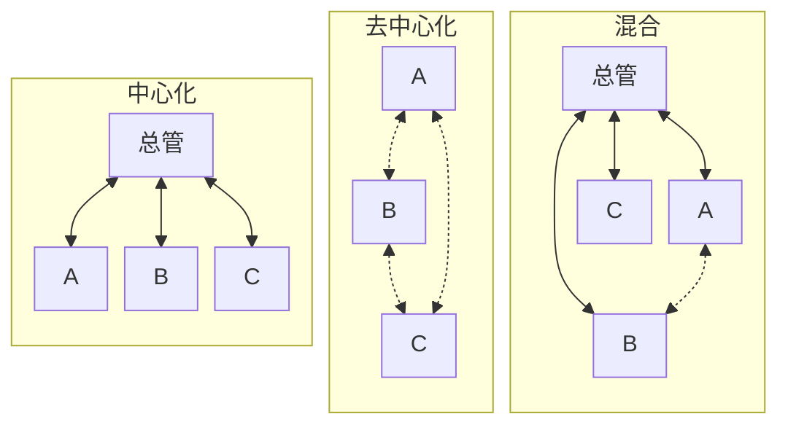

## 核心概要

多智能体不是任务变复杂之后的默认答案。一个 Agent 能可靠把任务做完，就先保持这样——论文里管这叫 SAS（Single-Agent System，单智能体系统）。确实要拆的时候，再把多 Agent 方案和 SAS 放在同样的任务、同样的预算下比，有明确收益才换，而不是先拆再说。

拆的时候看什么？看任务里信息怎么流动：调查做到一半的新发现，会不会改变其他子任务的工作前提。几条互不相干的调查，各自做完拼起来就够；如果一条发现必须立刻让其他人改做法，就得有人在执行过程中传话、重新分工和收尾——可以指定一个总管统一调度，也可以让执行者直接对话，或者总管管全局、只放开局部的直接通信。

## 一个需要中途协作的评估任务

假设要评估：

> 一个业务系统是否应该从数据库 X 迁移到 Y？给出兼容性风险、性能依据、改造成本和建议。只做评估，不修改生产环境。

这是为了教学设想的场景，不是某次真实迁移的记录。为了对比方便，把调查拆成三块：A 查兼容性，B 测性能，C 算成本。字母只是执行者的代号，不代表要用不同的模型，也不代表非得三个。性能测试只在隔离的测试环境里跑。

交付有两条硬要求：每项结论都要能回查到证据；三部分必须基于同一个数据库版本和同一种查询写法——不能用旧写法下的测试成绩，论证新写法迁移后也更快。

调查进行到一半，A 发现 Y 不支持业务正在用的一种查询，必须改写；B 原来的性能测试因此作废；C 要把改写和补测算进成本。

五种架构的差别，就体现在这条发现怎么传到 B、C 手里、由谁决定下一步工作。下面沿用 Google Research 介绍的分类。[架构分类来源](https://research.google/blog/towards-a-science-of-scaling-agent-systems-when-and-why-agent-systems-work/)

## 同一个任务，五种做法

### SAS：一个 Agent 从头做到尾

一个 Agent 先查兼容性，发现查询要改写，就调整测试方法、重新估算成本，全程由它自己推进。

这里的“单”说的是只有一个负责推进的 Agent，不是只问模型一次。它可以反复调用工具、根据结果修正判断。

这个例子里，前一步的发现直接决定后一步的做法，连贯的上下文很值钱。反过来，如果一个 Agent 已经能可靠完成整个调查，再往上加执行者就需要额外理由——“步骤多”“跑了很久”本身都不算。

### Independent（独立并行）：各做各的，最后拼结果

程序为 A、B、C 各开一个独立上下文，并发运行。A 不知道 B 的进展，B 也收不到 A 刚发现的不兼容问题；三份结果全部返回后，程序把它们拼成一份。

实现可以很简单：没有持续派工的总管，也没有执行中的讨论。

它适合互不相干的调查。可在这个例子里，A 的发现会推翻 B 的测试前提，各做各的等于让 B 白跑一趟，最后还可能把基于不同前提的结论拼进同一份报告。

并行不等于互相验证。论文 v3 的 Independent 配置只在末尾拼接输出，不做交叉核验，也不投票；如果你另外加了验证器，那已经是另一种实验配置，不能直接把它的效果结论套过来。[论文第 3.1 节](https://arxiv.org/html/2512.08296v3#S3.SS1)

### Centralized（中心化）：总管分工、追问和收尾

总管 Agent（orchestrator）把任务分给 A、B、C，收回结果，决定要不要补查。子 Agent 之间不直接通信，有发现交给总管，由总管转达。

A 报告查询不兼容之后，总管可以让 B 改测替代写法，同时让 C 把改写和补测计入成本；等新结果回来，总管再核对几方结论是否一致。**它和 Independent 的区别在于：执行过程中有人根据新发现重新安排工作，而不是到最后才合并文本。**

落地时把子 Agent 包装成可调用的任务，返回发现、证据和没解决的问题；总管掌握任务进度，子 Agent 只拿到完成自己那部分所必需的资料。这也是常见的“主 Agent 调用子 Agent”写法。[子 Agent 模式](https://docs.langchain.com/oss/python/langchain/multi-agent/subagents)

风险同样集中在总管这个位置：总管一旦误解了 A 的报告，B、C 会一起收到错误指令；如果每个细节都要经总管转述，总管需要处理的消息越来越多，也可能拖慢整个任务。

### Decentralized（去中心化）：执行者直接对话

没有总管。A 直接把发现告诉 B：“这个查询不兼容，原来的测试说明不了迁移后的性能。”B 改测，测完再把新增索引的需求告诉 C，C 相应调整成本。

论文测的是同伴按轮次讨论、最后投票定结果的配置，不是无限制的自由群聊。落地时，程序负责把每条新发现送进相关同伴的上下文，并执行轮次上限和结果选取规则；投票解决不了的分歧要原样保留，不能逼模型编出一个一致结论。[论文架构说明](https://arxiv.org/html/2512.08296v3#S3.SS1)

它适合调查方向互相影响、一条消息真能改变下一步工作的情况。但消息变多不等于信息变多：同一个判断反复复述，只增加费用；多数 Agent 点头，也代替不了可核验的证据。

### Hybrid（混合）：总管管全局，同伴处理局部

总管保留目标、分工和最终验收权，同时允许部分子 Agent 直接通信。

在这个例子里，可以让 A、B 直接对齐查询改写和性能测试，形成一致的测试前提后再报告总管；总管据此决定要不要 C 重算成本、还需不需要别的调查。不是所有消息都要过总管，也不是谁都能改动总任务。

它适合“整体上要统一，局部又确实要来回讨论”的任务。如果没有这种来回讨论的需要，多出来的通信通道就用不上，还要维护额外的消息和任务状态。

下面只画需要持续协调的三种。实线是总管与子 Agent 之间的双向消息，虚线是同伴之间的双向消息；连线表示允许通信，不代表每条消息都会真的发出去。

这张图说的是通信拓扑——谁能给谁发消息，不是服务器部署图。多个 Agent 可以跑在同一个进程里；反过来，给一个 Agent 接上多个云端工具，也不等于就成了多智能体系统。

## 实验结果：要看和谁比

《Towards a Science of Scaling Agent Systems》把这五种配置放在同样的任务下比较。以下都用论文 v3 的数据，SAS 是基线。

例如，在 PlanCraft 测试里，Agent 要根据物品配方和当前库存安排制作步骤，一步操作会改变后续可用的材料，所以顺序很关键。论文报告的平均成功率是：

| 架构 | PlanCraft 平均成功率 |
| --- | ---: |
| SAS | 56.8% |
| Independent | 17.0% |
| Centralized | 28.2% |
| Decentralized | 33.2% |
| Hybrid | 34.6% |

**Hybrid 只是四种多智能体里退化最少的，仍然不如 SAS。** 从 56.8% 到 34.6%，少了 22.2 个百分点，相对降幅约 39%。“退化最少”不能转述成“最适合顺序任务”。[论文第 4.2 节](https://arxiv.org/html/2512.08296v3#S4.SS2)

换一批任务，答案又不一样。在金融资料分析任务 Finance-Agent 里，Centralized 的平均表现从 SAS 的 34.9% 提高到 63.1%；在网页检索任务 BrowseComp-Plus 里，Decentralized 从 31.8% 提高到 34.7%。这组数据支持按任务结构选型，不支持给五种架构排一个固定名次。

在上述 PlanCraft 实验里，Independent 的成功率最低，但这不意味着它在所有任务里都最差。它缺了中途协作，放在这个迁移例子里确实不合适；但如果任务只是各自查清三份互不相干的资料，多加讨论未必带来好处。模型、工具、预算、汇总方法任何一个变了，结论都得重新测。

## 这个案例会怎么选

回到交付要求：A 发现不兼容之后，B、C 都要更新自己的工作前提，且依据可回查。就按这条要求筛，不给五种架构各打一个总分。下面是这个案例的工程判断，不是论文的额外结论。

| 候选 | 在这个案例里的处理 |
| --- | --- |
| SAS | 留作基线。如果单 Agent 能可靠完成，等待和费用也能接受，就没有替换的理由。 |
| Independent | 不选只有末尾拼接的配置。A 发现问题时它动不了 B、C，结论可能建立在过期前提上。 |
| Centralized | 第一个要验证的多 Agent 候选。总管把新前提发给相关执行者，要求补测、重算，再检查返回结果是否一致。 |
| Decentralized | 暂不选。当前要的是把一条发现落实到其他任务，还没有需要全体执行者互相协商的部分。 |
| Hybrid | 留作改选项。等 A、B 确实需要反复对齐、总管转述成了瓶颈，再开放它们之间的直接通信。 |

这里选的是下一个要验证的候选，不是终局。Centralized 多了总管的调用和消息传递，不保证更快、更便宜；正式采用之前，要用同样的任务证明这些额外工作确实减少了遗漏或等待。

条件一变，选择跟着变。三项调查如果改成分别核对互不相干的资料、执行中不需要共享发现，Independent 加上合适的末尾校验可能就够；如果子 Agent 必须在调查过程中直接互相追问，就重新比较 Decentralized 和 Hybrid，而不是抱着原来的通信方式不放。

还有一道更早的判断：子任务真的需要 Agent 吗？读版本号、汇总账单、跑一组已知测试，通常交给脚本或普通工具就够了。只有那些需要根据结果继续追查、随时调整方法的部分，才值得保留 Agent 的执行循环。[工作流与 Agent 的区别](https://www.anthropic.com/engineering/building-effective-agents)

## 选完之后，用什么结果拍板

先实现 SAS 和 Centralized 的同任务对照就够了，不必一次做全五套。已有 SDK 能创建独立上下文、调用工具、返回结果，就直接复用；复杂的暂停恢复、条件分支再交给编排框架。用哪个框架不决定谁和谁通信。

在这个例子里，每条调查结果至少保留**结论、证据位置、测试前提、未确认事项**。只回一句“建议迁移”，总管没法判断它漏没漏关键限制。Anthropic 的多 Agent 研究实践同样强调把委派边界说清楚，用可回查的产物减少多次转述造成的信息丢失。[工程实践](https://www.anthropic.com/engineering/multi-agent-research-system)

任务、消息和状态，最少要约定什么

一次子任务要说清目标、已有资料、可用工具、不能做的事、完成条件，以及时间和费用上限。只给一句“你是性能专家”不够用。

一条消息要能找到所属任务、发送方、接收方和它依据的资料版本。比如 B 的结果应该写明“已采用 A 提出的查询改写”，而不是一句“性能符合要求”。收到建立在旧前提上的结果，标记为待更新，不能拿它覆盖新结论。

总管或调度程序要记录每个任务是进行中、已完成、失败还是等待输入。超时不是成功，子 Agent 结束了也不代表总任务完成。撞到预算上限时，交付已有证据和缺口，靠无限加派 Agent 拖下去没有意义。

Agent 会改文件或操作外部系统时，还要指定谁有写权限，没有权限就不要动对应的资源。同一个资源别让多个 Agent 无约束地同时改；一次调用超时了，先核对结果有没有生效，再决定要不要重试。独立上下文不会自动带来权限隔离，消息传得再勤也代替不了授权检查。

任务需要跨进程重启恢复时，再把消息和进度存到外部存储，具体做法见[服务重启后，Agent 怎么记得前文并接着做](/ai/agent-context-persistence-recovery/)。

对比时固定问题、资料版本、模型配置、可用工具和验收标准，给两种方案相同的总费用上限，并把总管、子 Agent、汇总和重试全部算进费用。结果有波动就重复运行，别拿一次成功的截图下结论。

迁移评估可以盯四件事：关键不兼容项有没有漏；性能结论是不是建立在正确的改写版本上；成本有没有覆盖必要改造；证据不足时有没有明说。同时记录总耗时、实际费用和人工补查次数。还可以故意让一个子任务超时、让两份证据互相矛盾，看系统怎么收场。

如果 Centralized 只是报告变长了，这些检查一项没改善，那就不构成替换 SAS 的理由。如果它确实减少了关键遗漏但费用更高，就得说清这部分改善值不值多花的钱——只报成功率是不够的。

继续阅读：[Agent 运行环境怎么选：本机、云端、边缘与沙箱](/ai/agent-runtime-environments/) · [AI Agent 记忆系统设计：短期、长期、情景记忆](/ai/agent-memory-system-design/)
