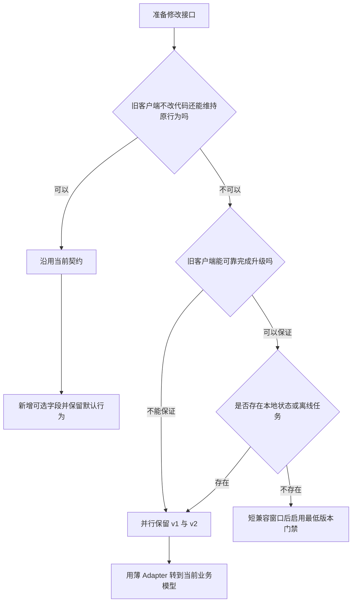
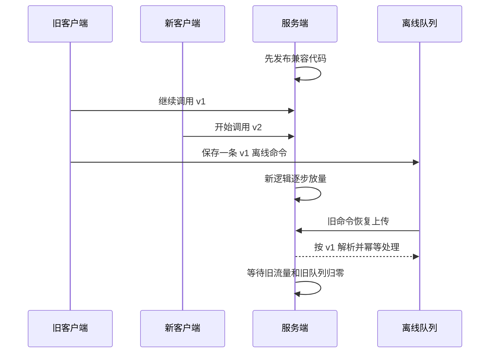
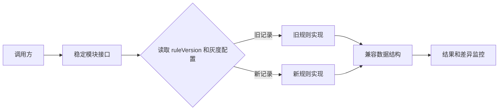
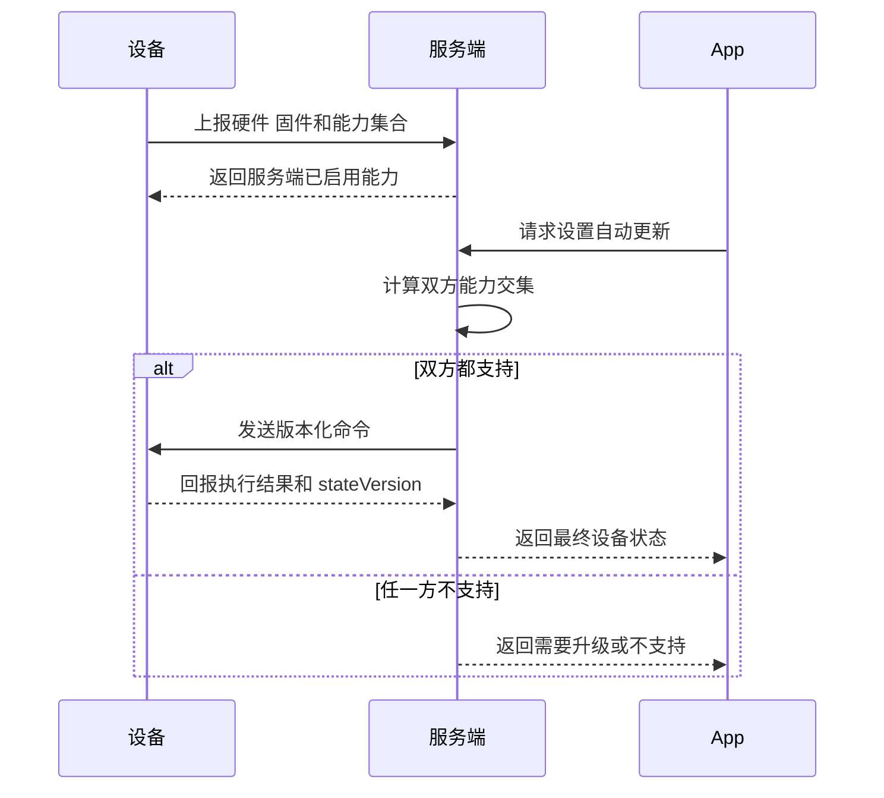
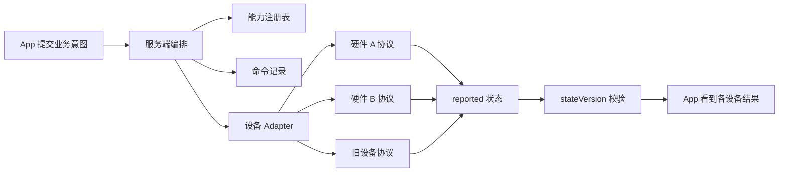
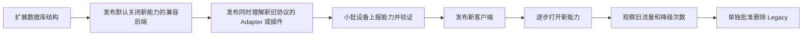

后端已经发布，iOS 新版还在审核，Android 用户有人关掉了自动更新。仓库里另有一批几周没联网的设备。此时删掉旧接口，故障不会立刻出现。旧 App 下次打开，或者离线设备把积压的命令发回来，用户才会碰到它。

这类系统很难找到一个所有组件同时切换的时刻。服务端可以在几分钟内发布，App 更新要经过商店和用户，固件还受网络、电量、硬件批次与现场条件影响。一个版本上线后，新旧实现通常会共存一段时间。平滑升级要处理的就是这段时间。

版本号只能告诉系统一份契约来自哪里。旧客户端能否继续工作，新数据能否被旧代码读取，一条命令在不同硬件上会不会产生相同结果，都要另行设计。

## 先从一个客户端和一个服务端说起

只有一种自有客户端时，最省事的办法通常是继续使用原接口。

增加一个可选请求字段，客户端不传时沿用旧行为。响应增加字段，旧客户端会忽略。已有字段、默认值、错误码和权限要求保持不动。这类改动可以跟随原契约发布，没必要每次都创建新版本。

这里有个容易踩的坑。JSON 能解析，不等于客户端还能正常运行。Google 在 [AIP-180](https://google.aip.dev/180) 里把兼容分成源代码、传输格式和业务语义几层。响应新增枚举值看上去只是多了一种取值，旧客户端若写了穷举分支，仍可能直接失败。服务端给列表加上分页，也会让原本一次取全量数据的客户端悄悄少拿一部分。

可以先用下面这棵树判断一次变化是否需要新版本。



当字段含义、状态机或业务规则已经改变，继续往原接口里塞条件判断会越来越危险。此时可以保留 `/v1/...`，再增加 `/v2/...`。URL 版本最容易调试和路由，也适合拿来解释方案。Header 能保持资源路径稳定，Query Parameter 便于直接查看。三种方式都有人用，选定一种并贯穿日志、缓存和文档即可。

App 的构建版本和 API 契约版本要分开。App 发了一次版，不代表接口一定变化。一份 App 也可能在迁移期同时调用 v1 和 v2。

客户端启动或登录时可以做一次握手。

```json
{
  "clientBuild": 120,
  "supportedApiVersions": ["1", "2"],
  "negotiatedApiVersion": "2",
  "capabilities": ["offline-sync-v2"],
  "minSupportedBuild": 105,
  "latestBuild": 123,
  "updatePolicy": "recommended"
}
```

握手适合决定当前客户端能用哪些功能，也能提示升级或限制高风险入口。它管不到已经排队的离线命令。长连接断开以后还要重新协商，多节点服务也不能只把协商结果放在一台机器的内存里。

应用版本太低时，服务端应返回稳定的业务错误码，例如 `CLIENT_VERSION_UNSUPPORTED`，同时给出最低版本、更新地址和宽限期。HTTP `426 Upgrade Required` 用来切换当前连接上的通信协议，拿它表示 App 版本太低并不合适。

## 强制升级只能留给少数情况

消费级 App 很难被可靠地强制升级。Apple 的分阶段发布只会逐步覆盖开启自动更新的用户，用户仍可手动下载。Android 的即时更新需要用户接受，也可能被取消或安装失败。商店显示新版已经发布，不能证明旧客户端已经消失。

严重安全漏洞、旧协议会损坏数据、法规要求改变，或者服务端已经无法安全维持旧语义，这几种情况可以启用最低版本门禁。普通功能迭代更适合提示升级，并让旧版本继续完成登录、同步、导出和账号恢复。

只要客户端保存草稿、本地数据库或离线写队列，兼容窗口就要覆盖最长离线时间、队列 TTL 和重试期。每条离线命令应携带自己的 `schemaVersion` 或 `commandVersion`。涉及计费、结算和状态机的记录还要保存 `ruleVersion`，否则历史记录可能被新规则重新解释。



## 业务逻辑换代也要允许新旧并存

接口不变，模块内部的规则也可能发生破坏性变化。计费顺序调整、订单状态机重写、任务调度算法替换，都可能让同一份历史数据得到不同结果。直接替换实现会让新请求和在途任务一起切换，回滚时也很难知道该恢复哪套规则。

这类改动可以在调用方与实现之间放一层稳定接口，让旧实现和新实现暂时共存。新请求先进入小流量，已经创建的订单、任务或会话继续按记录中的 `ruleVersion` 处理。新实现稳定后停止创建旧版本记录，等在途任务结束，再删旧实现。



Feature Flag 可以控制新实现接收多少流量，也可以在异常时迅速关掉入口。它无法让旧实现读懂已经写坏的数据。数据库仍要先扩展结构，确保两套代码都能读写，随后回填和校验，最后才收缩旧结构。

## 多种硬件不能只比较版本号

设备加入以后，`firmwareVersion >= 3.2.0` 这样的判断很快会失效。同一固件可能为不同 SKU 使用不同编译选项，同一型号也可能更换主板或外设。设备还会处在部分损坏、模块缺失和升级回滚后的状态。版本相同，实际能力未必相同。

Matter 提供了一个很实用的思路。设备用 `FeatureMap` 声明支持的功能，用 `ClusterRevision` 表示实现了哪一版能力定义。控制端读取两者，再决定展示什么界面、发送什么命令。固件版本仍然有用，适合排障、分组和选择 OTA 目标，不适合单独决定一条业务命令能不能执行。

一份能力声明可以很简单。

```json
{
  "deviceId": "stage-a",
  "hardwareRevision": "rev-c",
  "firmwareVersion": "3.4.1",
  "capabilitySetVersion": 7,
  "capabilities": [
    "storage.multi-volume.v1",
    "device-control.volume.v1",
    "device-control.auto-update.v1"
  ]
}
```

服务端也要声明自己准备开放哪些能力。只有两边的能力集合都包含目标项，服务端才发送新命令。设备重连、升级或回滚后重新上报，能力缓存带版本号或哈希，避免服务端一直相信旧快照。



多设备操作还要回答一个用户层面的问题。一组设备里有三台成功、一台降级、一台离线，接口不能只返回一个笼统的成功。服务端应给出每台设备的结果，至少区分完成、降级、拒绝和超时。涉及门锁、扣费或安全策略时，静默降级通常比明确失败更危险。

## 状态快照和命令记录要分开

设备可能离线，App 又希望立即设置一个目标值。Device Shadow 一类模型会把期望状态放进 `desired`，把设备实际状态放进 `reported`，再根据差异生成 `delta`。AWS IoT Device Shadow 还提供递增的 `version`，设备可以拒绝过期更新，服务端也能避免旧消息覆盖新状态。

Shadow 适合让状态最终收敛，不能充当完整的命令队列。一次开门、扣费或播放操作需要独立的请求记录、执行结果和审计信息。MQTT QoS 1 允许重复交付，有副作用的命令仍要依靠 `messageId` 或 `idempotencyKey` 去重。



Adapter 只负责转换字段、单位、错误和协议格式。业务规则放在服务端的统一模型里。若新旧协议的语义无法互相表达，就保留两套规则实现，并把规则版本写入业务记录。把设备型号判断散落在业务代码中，过一两年后很难再说清哪条旧分支还在使用。

## 五种整体方案怎样选

| 方案 | 适合的系统 | 主要代价 |
| --- | --- | --- |
| 最低能力交集 | 功能少，所有设备必须表现一致 | 新硬件长期被旧硬件限制 |
| 能力驱动的服务端编排 | 异构设备长期共存，需要逐台返回结果 | 要维护能力注册表、编排和补偿 |
| 边缘网关转换 | 旧设备不能 OTA，需要离线运行或局域网协议很多 | 网关会集中故障，协议转换可能丢语义 |
| 最低版本门禁 | 安全、计费和跨设备一致性要求很高 | 旧设备会被阻断，升级失败必须有出口 |
| 双协议迁移 | 已有大量在线设备，新旧路径需要共存一段时间 | 测试矩阵扩大，旧路径容易永久留下 |

对长期存在多种设备的产品，我更倾向于能力驱动的服务端编排。旧协议留在 Adapter 或边缘网关，新功能由能力交集放行，OTA 逐步缩小版本分布。最低能力交集可以用于某一次群组操作，不宜把整个产品永久锁在最老设备上。

只有一个客户端类型时，完整 BFF 往往偏重。微软的 BFF 指南也把单一前端列为不适合的情况。薄 Adapter 已经能隔开 v1 和 v2，核心业务仍然只有一份。

Feature Flag 可以按账号、设备或稳定标识做灰度，也能提供紧急关闭开关。它要求新旧契约本来就能工作。旧客户端无法解析新格式时，开关救不了它。

## 发布顺序比版本命名更要紧

一套能独立发布的顺序通常长这样。



数据库也要跨过同一段共存期。先增加可空列、新表和索引，让旧代码仍能读写。随后双读或双写，分批回填历史数据，再切换读取来源。应用回滚时保留新增结构。等旧代码没有流量、回填完成并通过对账，才删除旧字段。

回滚不能只看旧安装包还在不在。新版本写出的数据若旧代码读不懂，代码虽然切回去了，系统仍然恢复不了。涉及跨系统双写时，还要用 Outbox、幂等和对账处理其中一次写入失败的情况。

测试矩阵不必把所有历史版本两两组合。至少守住四组关系。

- 最新服务端和最老受支持客户端
- 最新服务端和当前生产客户端
- 最新客户端和当前生产服务端
- 最新客户端和下一版服务端

设备系统再加上旧插件与新插件、关键硬件 revision、离线重放和乱序状态。Pact 一类消费者契约测试可以把接口组合变成发布门禁，设备执行、状态迁移和 OTA 仍需要集成测试与实机验证。

旧路径退役需要证据。旧接口流量、协议降级次数、旧 App 分布、设备能力覆盖率、离线队列寿命和双写差异都应可观测。代码里已经找不到调用者，只能说明当前仓库没有引用，说明不了生产环境没有旧客户端。

## 一个尚未上线的匿名案例

有一套由 App、云端和边缘设备组成的系统，最近把账号级业务拆成了设备级业务。它保留原有接口，另建 V2 Controller、DTO、服务和独立存储键。旧 App 与旧插件继续走 Legacy，新插件能够识别两种载荷，新 App 只在设备和服务端都声明目标能力时进入 V2。

设备上报使用版本化信封。`messageId` 负责幂等，`requestId` 串起 HTTP 受理、MQTT 命令和设备结果，`stateVersion` 阻止乱序状态覆盖最新快照。数据库先增加可空字段和新表，回滚应用时不删这些结构。这个主体方案与前面的推荐路径一致。

固件升级后来又增加了前置版本链。管理端可以指定某个版本必须先经过哪一版，服务端根据设备当前版本返回最早缺少的安装包。它解决了老设备不能直接跨越数据格式或引导程序变化的问题。

这条前置链只按平台和版本记录选包。不同主板、CPU 架构和设备能力怎样选择安装包，灰度中止与安装失败怎样回滚，当前实现都没有覆盖。它是完整 OTA 方案中的一小段。

这段改动同时删掉了旧的公开版本查询接口。现有材料没有旧接口流量归零、客户端覆盖率和单独下线批准的证据，新接口也还没有补进客户端契约文档。前置版本链本身合理，删除旧入口的时机没有站稳。

这套代码目前停在独立开发分支。定向测试已经覆盖能力协商、状态版本和固件前置链，生产 DDL、后端部署、新 App 切换、多设备验收和 Legacy 退役仍未完成。文章能从中确认设计选择，不能把它写成生产已经跑通的经验。

新版本发布，只代表迁移开始。等最老的受支持客户端仍能工作，离线命令已经处理完，不同硬件都给出可解释的结果，旧流量也确实归零，删除才有依据。

## 参考资料

- [Google API 向后兼容指南](https://google.aip.dev/180)
- [GitHub REST API 版本规则](https://docs.github.com/en/rest/about-the-rest-api/api-versions)
- [Matter 1.2 核心规范](https://csa-iot.org/wp-content/uploads/2023/10/Matter-1.2-Core-Specification.pdf)
- [AWS IoT Device Shadow 文档](https://docs.aws.amazon.com/iot/latest/developerguide/device-shadow-document.html)
- [Android A/B 系统更新](https://source.android.com/docs/core/ota/ab)
- [Apple 分阶段发布说明](https://developer.apple.com/help/app-store-connect/update-your-app/release-a-version-update-in-phases)
- [HTTP Deprecation 响应头规范](https://www.rfc-editor.org/rfc/rfc9745.html)
- [HTTP 语义规范](https://www.rfc-editor.org/rfc/rfc9110.html)
- [Azure BFF 架构模式](https://learn.microsoft.com/en-us/azure/architecture/patterns/backends-for-frontends)
- [Pact 发布兼容矩阵](https://docs.pact.io/pact_broker/can_i_deploy)
