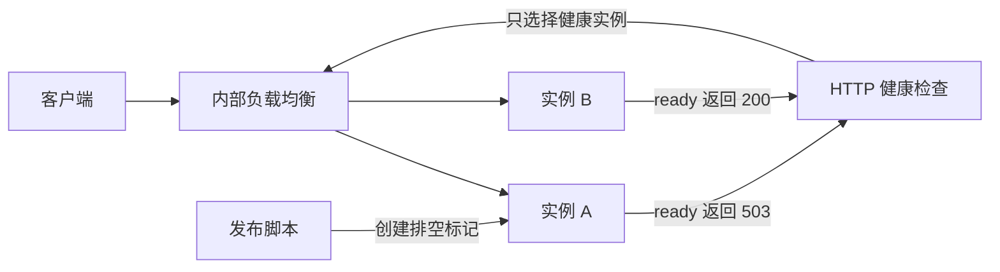
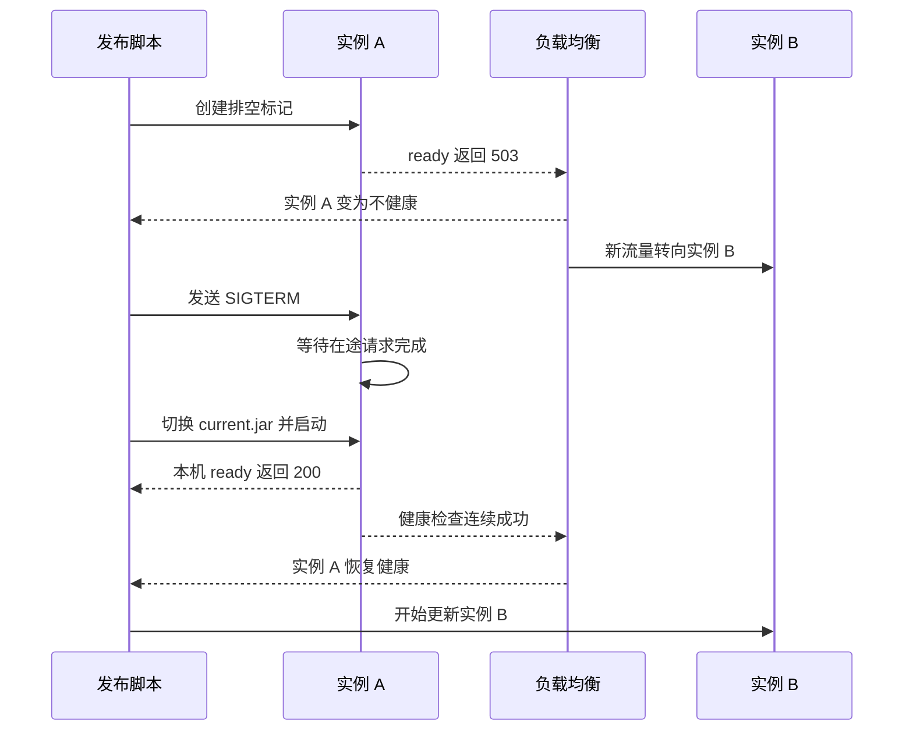
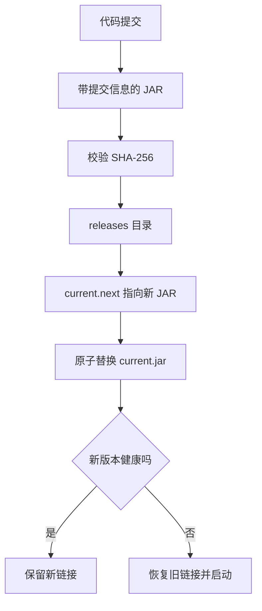

服务只有两台虚拟机，也可以把发布做得相当稳。需要先承认一个边界。平滑发布能减少计划内更新造成的连接失败，无法替应用消除所有故障。长连接会不会断、数据库变更能不能兼容、旧版本能否继续处理消息，仍然要逐项设计。

下面这套方案来自一次真实改造。系统运行在两台 GCP Compute Engine 实例上，前面是区域级内部负载均衡，应用是 Spring Boot。改造前，systemd 用 `kill -9` 停止 Java，负载均衡使用 TCP 健康检查，却把 `/api/v1/ping` 当作请求内容直接发给 HTTP 端口。Tomcat 收到的只是路径字节，没有 HTTP 请求行，于是持续记录非法方法日志。更新时也没有明确的排空步骤。

改造后的流程没有引入 Kubernetes，也没有常驻发布平台。它只增加了一个 readiness 接口、一份 systemd 配置和一个滚动发布脚本。两台实例逐台更新，产物可以追溯到提交，失败后能切回旧版本。

## 这套方案解决到哪一步

一次安全更新至少包含四个不同动作。

1. 停止把新请求送给待更新实例。
2. 给已经进入实例的请求留出完成时间。
3. 让 Java 收到 `SIGTERM`，执行 Spring Boot 的优雅停机。
4. 新版本通过本机和负载均衡两层检查后，再更新下一台。

少一个动作，流程都可能留下空档。直接停进程会打断在途请求。只让健康检查失败，却立刻停进程，负载均衡状态还可能没有传播完成。新进程启动成功，也不能说明它已经能接流量。



这里的 readiness 表示“现在能否接收新流量”。它和进程存活、端口可连接、业务请求成功是三件事。Spring Boot 的 [Application Availability 文档](https://docs.spring.io/spring-boot/3.5/reference/features/spring-application.html) 也把 liveness 和 readiness 分开。liveness 反映进程能否自行恢复，readiness 反映当前是否适合接收请求。

## readiness 由应用回答

改造后的接口是 `GET /api/v1/ready`。它在正常状态返回 `200 READY`，看到本机排空标记后返回 `503 DRAINING`。接口还读取 Spring 的 `ApplicationAvailability`。应用尚未进入 `ACCEPTING_TRAFFIC` 时，即使 HTTP 端口已经打开，也返回不可用。

判断可以简化成下面这段代码。

```java
public Status status() {
    if (Files.exists(drainMarker)) {
        return Status.DRAINING;
    }
    if (!Files.notExists(drainMarker)) {
        return Status.NOT_READY;
    }
    return availability.getReadinessState() == ReadinessState.ACCEPTING_TRAFFIC
            ? Status.READY
            : Status.NOT_READY;
}
```

`Files.exists` 和 `Files.notExists` 在无法判断文件状态时都可能返回 false，这时服务进入 `NOT_READY`。发布系统无法确认实例状态时，继续接收新请求会把未知状态扩散给用户。Controller 只需把 `READY` 映射为 200，其余状态映射为 503。

这个接口应放在业务服务使用的同一端口。Spring Boot 的 [探针说明](https://docs.spring.io/spring-boot/3.5/reference/actuator/endpoints.html) 提醒过，管理端口健康而业务端口失效，会制造错误的可用信号。健康检查通常需要绕过业务登录，但仍应通过内网、防火墙来源范围或网关规则限制访问。

排空标记放在 `/run/my-service/draining` 一类的运行时目录。发布脚本用 `touch` 进入排空，用删除文件恢复接流量。它不需要改数据库，也不需要重启进程才能生效。systemd 的 `RuntimeDirectory` 可以创建目录，并在服务停止后清理短期状态。`RuntimeDirectoryPreserve=restart` 会在服务重启期间保留目录，避免应用在排空阶段意外重启后立刻重新接流量。

```ini
[Service]
Type=simple
User=my-service
RuntimeDirectory=my-service
RuntimeDirectoryPreserve=restart
ExecStart=/usr/bin/java -jar /srv/my-service/current.jar
Restart=on-failure
KillSignal=SIGTERM
TimeoutStopSec=60
```

负载均衡健康检查改成完整的 HTTP 请求，路径指向 `/api/v1/ready`，端口与业务端口一致。此次落地使用 2 秒检查间隔、2 秒超时、连续两次失败判定不健康、连续两次成功恢复健康。发布脚本不按四秒钟做推断，而是轮询云端看到的实例健康状态。检查调度、网络传输和负载均衡内部传播都会带来偏差，固定睡眠只能当附加缓冲。

Google Cloud 的 [健康检查说明](https://cloud.google.com/load-balancing/docs/health-check-concepts) 明确区分了新连接资格和已有连接。实例被判为不健康后，不再被选择处理新连接，已有连接不会因此立刻终止。这一点决定了后面的停机仍要交给应用完成。

## 一台实例怎样退出和回来

发布始终一次只处理一台。开始前先确认两台都健康。若另一台已经异常，本轮发布直接停止，不能再减少容量。



一次单机更新的顺序如下。

1. 确认两台实例都处于健康状态。
2. 在目标实例创建排空标记，并确认本机 readiness 返回 503。
3. 等待负载均衡把目标实例标记为不健康，再留一小段传播缓冲。
4. 通过 systemd 停止服务，让 Java 收到 `SIGTERM`。
5. 切换到新产物并启动，确认本机 readiness、进程状态和最近错误日志。
6. 等待负载均衡重新判定健康，确认另一台仍健康，再处理下一台。

Spring Boot 显式启用优雅停机，并给每个停机阶段 20 秒。

```yaml
server:
  shutdown: graceful

spring:
  lifecycle:
    timeout-per-shutdown-phase: 20s
```

systemd 的 `TimeoutStopSec` 设为 60 秒，给 Spring 留出的时间更长。上游 [systemd.service 手册](https://github.com/systemd/systemd/blob/main/man/systemd.service.xml) 说明，停止超时后，服务可能进入强制终止阶段。把 systemd 超时设得比应用超时还短，会让 Spring 的配置失去作用。

旧配置里的 `ExecStop=/usr/bin/kill -9 $MAINPID` 必须移除。`SIGKILL` 不会触发 JVM shutdown hook，Spring 没有机会等待请求、关闭线程池和释放资源。常规停止使用 `SIGTERM`，超时后的强制终止继续由 systemd 兜底。

## 连接排空容易被说过头

这次云端后端服务原本配置了 300 秒 connection draining。这个数字不能直接拿来证明 readiness 变成 503 后，负载均衡会替应用等待 300 秒。

Google Cloud 的 [连接排空文档](https://cloud.google.com/load-balancing/docs/enabling-connection-draining) 把它与从实例组移除实例、从网络端点组移除端点等操作联系在一起。健康检查失败会影响新连接的选择，和执行后端移除是两条不同路径。不同负载均衡类型对连接、连接池和全部后端不健康时的处理也有差异。

因此，这套实现对普通短请求的保护来自三处。负载均衡停止选择目标实例，脚本等待云端状态传播，Spring 在收到 `SIGTERM` 后等待在途请求。它没有承诺 WebSocket、流式响应、长轮询和任意持久连接始终不断。存在这类连接时，需要补上客户端重连、会话恢复和协议级排空验证。若云平台支持对单个后端执行明确的移除或权重调整，也可以把该操作纳入发布流程，再按对应产品的连接排空语义验收。

## 版本化产物让回滚足够简单

每次构建得到一个带提交标识的只读 JAR，上传后校验 SHA-256。运行入口 `current.jar` 是符号链接，切换通过临时链接加原子重命名完成。发布脚本记录旧链接，启动失败、健康检查超时或收到中断信号时，都能切回旧产物并恢复服务。



产物校验也要接受测试。此次改造的第一次发布尝试在远端修改前停止，原因是校验程序按 Java properties 读取提交信息，而构建产物里保存的是 JSON。修正解析和测试后，发布才继续。这个失败没有影响线上实例，也说明了两个事实。产物携带来源信息很有用，读取来源信息的代码同样可能出错。

相同版本再次执行发布时直接跳过重启。幂等检查能减少重复操作造成的风险，也让流水线重试更可控。

## 首次迁移要拆开做

旧版本没有 `/api/v1/ready` 时，不能先把负载均衡健康检查切过去。两台实例会同时被判为不健康。可落地的迁移顺序分成两轮。

第一轮在低流量窗口逐台部署支持 readiness 和优雅停机的新版本。此时沿用旧健康检查，发布过程还不具备完整排空能力，所以这一步不能宣称已经平滑。第二轮等两台实例都支持新接口后，再把云端健康检查改成 HTTP readiness，确认两台重新健康。后续发布才走完整流程。

回退也要考虑接口兼容。若旧产物完全不提供 readiness，云端健康检查已经切换后，直接回退会让实例无法恢复健康。实际脚本应至少保留一个兼容 readiness 的稳定版本，或者把健康检查回退作为紧急操作的一部分。

## 这次验收得到了什么

落地后的验证记录如下。这里列的是观测结果，没有把它扩大成所有环境都成立的结论。

| 检查项 | 实际结果 |
| --- | --- |
| 两台实例启动 | systemd 均为 active，启动分别约 32 秒和 38 秒 |
| 应用就绪 | 两台本机 `/ready` 均返回 200 |
| 负载均衡状态 | 两台均恢复为 HEALTHY |
| 单机排空 | 创建标记后，本机返回 503，云端变为 UNHEALTHY，另一台保持 HEALTHY |
| 排空恢复 | 删除标记后，本机返回 200，云端恢复 HEALTHY |
| 重复发布 | 相同提交被识别，服务没有重启 |
| 健康检查噪声 | 改成 HTTP 检查后，没有再出现旧 TCP 请求造成的非法 HTTP 方法日志 |

这组验收能证明排空信号、云端摘流、单机更新和恢复过程已经按预期工作。它没有覆盖高并发下的尾延迟、长连接重连、跨版本消息兼容和数据库迁移。要回答这些问题，还需要压测、故障注入和真实客户端验证。

## 仍可能中断的地方

两台机器的滚动更新会把容量短时降到一台。单台无法承受峰值时，流程再严谨也会出现排队和超时。发布前的基线检查需要包含容量，而不能只看绿色状态。

还要查清全部后端不健康时的产品行为。[Google Cloud 健康状态说明](https://cloud.google.com/load-balancing/docs/health-check-concepts#health_state) 显示，内部直通网络负载均衡会根据 failover policy 决定丢弃新连接或把流量送给不健康后端。发布脚本每次只排空一台，不能取代这个配置检查，也防不住另一台在更新期间突然故障。发布窗口内应持续监控两台实例和入口错误率，一旦剩余实例异常就停止后续动作。

数据库变更是另一条风险线。新旧版本会在一段时间内同时运行，表结构和数据格式必须支持双方。常见做法是先增加兼容字段，再发布同时兼容新旧结构的应用，完成数据回填后才删除旧字段。把破坏性迁移和应用更新塞进同一次切换，会让快速回滚失效。

定时任务、消息消费者和单例任务也要单独处理。两个版本并行时，重复消费和重复执行可能比 HTTP 中断更难发现。任务需要幂等、租约或明确的领导者机制。

readiness 里是否检查数据库和外部服务，需要按流量语义决定。Spring Boot 官方文档不默认把外部依赖放进 readiness。共享数据库短暂抖动时，如果所有实例同时返回不可用，负载均衡可能面对全体后端异常。只有当实例缺少某项依赖就完全无法处理任何请求时，把它加入 readiness 才比较合理。能降级的依赖更适合由业务接口返回受控错误，并单独告警。

## 其他平滑发布方案怎么选

两台虚拟机加 readiness 的滚动更新，优势是改造范围小，值班人员能看懂每一步。它适合现有系统已经使用虚拟机和负载均衡，发布频率中等，实例数量不多的团队。随着连接时长、发布风险和实例数量上升，其他方案会更合适。

| 方案 | 额外成本 | 能得到什么 | 主要缺口 | 适合场景 |
| --- | --- | --- | --- | --- |
| 虚拟机逐台滚动 | 一份接口、systemd 配置和脚本 | 保留一台服务，回滚路径短 | 更新期容量下降，流量控制较粗 | 两台到少量实例，已有负载均衡 |
| 云端明确摘除后端 | 云 API、权限和状态编排 | 能使用产品定义的连接排空语义 | 各类负载均衡能力不同，脚本更复杂 | 长连接较多，需要明确控制单个后端 |
| Kubernetes RollingUpdate | 集群、探针、资源和运维体系 | readiness、滚动比例和终止流程由控制器编排 | 平台成本高，探针和资源配置仍会出错 | 团队已经稳定运行 Kubernetes |
| 蓝绿发布 | 同时维护两套环境 | 切流前验证完整新环境，回退快 | 临时占用近两倍资源，数据层仍需兼容 | 大版本升级，允许增加资源预算 |
| 金丝雀发布 | 流量切分、指标和自动判定 | 先让少量真实流量验证新版本 | 观测和流量控制投入高，错误指标会误导决策 | 访问量足够大，已有可靠业务指标 |

Kubernetes 不会自动消除所有停机问题。它的 [Pod 终止流程](https://kubernetes.io/docs/concepts/workloads/pods/pod-lifecycle/) 会更新端点状态、运行 `preStop`、发送 TERM，并在宽限期结束后强制结束容器。[容器生命周期钩子文档](https://kubernetes.io/docs/concepts/containers/container-lifecycle-hooks/) 说明，终止宽限期在 `preStop` 之前就已经开始，简单睡眠会占用应用自己的退出时间。`readinessProbe`、`maxUnavailable`、`maxSurge` 和 `terminationGracePeriodSeconds` 仍要一起核对。

蓝绿发布同时保留旧环境和新环境，先验证新环境，再切换生产流量。AWS 的 [ECS 蓝绿发布说明](https://docs.aws.amazon.com/AmazonECS/latest/developerguide/deployment-type-blue-green.html) 也把并行环境、测试流量和回退作为主要能力。它很适合运行时大升级和改动面较大的版本，代价是额外资源、环境一致性检查，以及数据库向前兼容。

金丝雀发布把少量流量送到新版本，再依据错误率、延迟和业务指标决定扩大或回退。[Argo Rollouts](https://argoproj.github.io/argo-rollouts/features/analysis/) 能把流量步骤和指标分析接进发布过程。它带来的额外保护取决于监控能否及时发现用户实际关心的失败。缺少可靠指标时，分批切流只是把发现问题的时间拉长。

## 一份能执行的检查单

发布前确认两台实例都健康，单台容量足以承接当前流量，新旧版本的数据库和消息格式兼容。产物要有提交标识和摘要，脚本应拒绝来源不明或摘要不符的文件。

单台发布期间至少记录这些状态。

```text
目标版本提交
旧版本链接
本机 readiness 状态
负载均衡看到的实例状态
systemd 退出结果
新进程启动时间
新版本日志错误
回滚是否执行
```

流程完成后，从负载均衡入口发起一次真实请求，确认两台实例都恢复健康，并检查发布窗口内的请求错误率和延迟。只测本机 `curl` 会漏掉健康检查配置、转发规则和入口网络问题。

对两台实例、短请求为主、已有负载均衡的系统，我会停在这一档。等长连接占比提高，再评估云端明确摘除后端。团队已经稳定运行 Kubernetes 时，可以把同样的 readiness 和退出约束交给控制器编排。平台本身不该成为平滑发布的前置目标。
